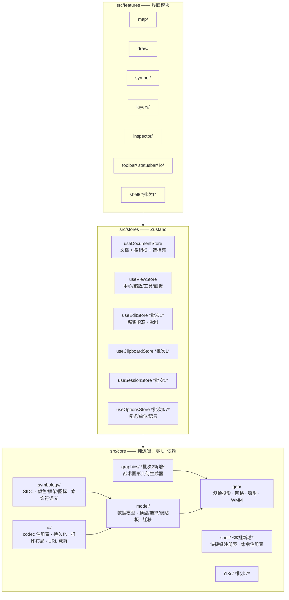
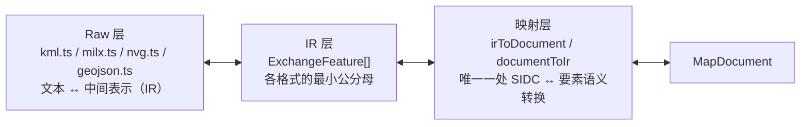
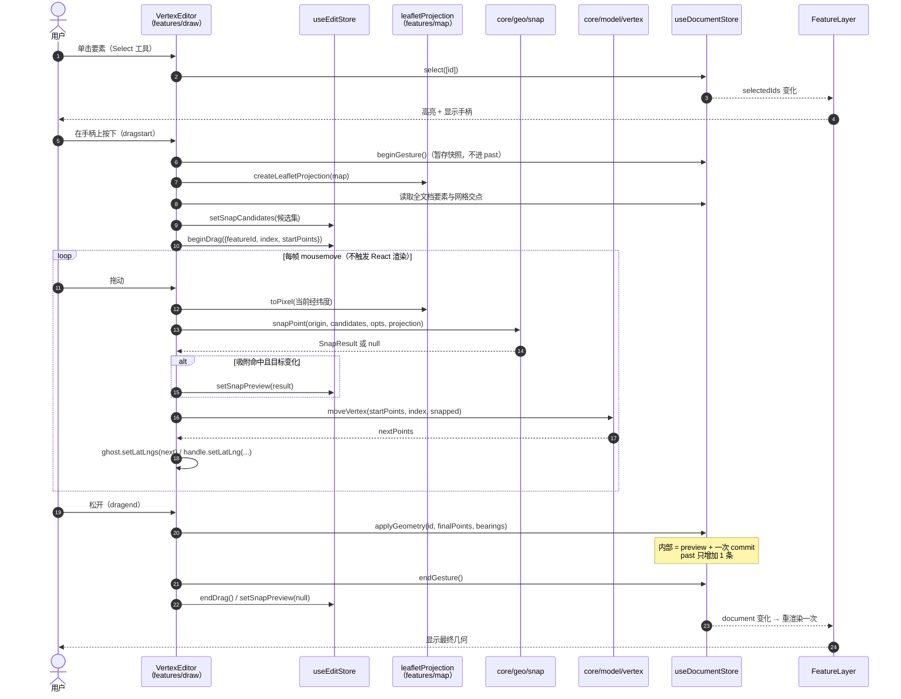
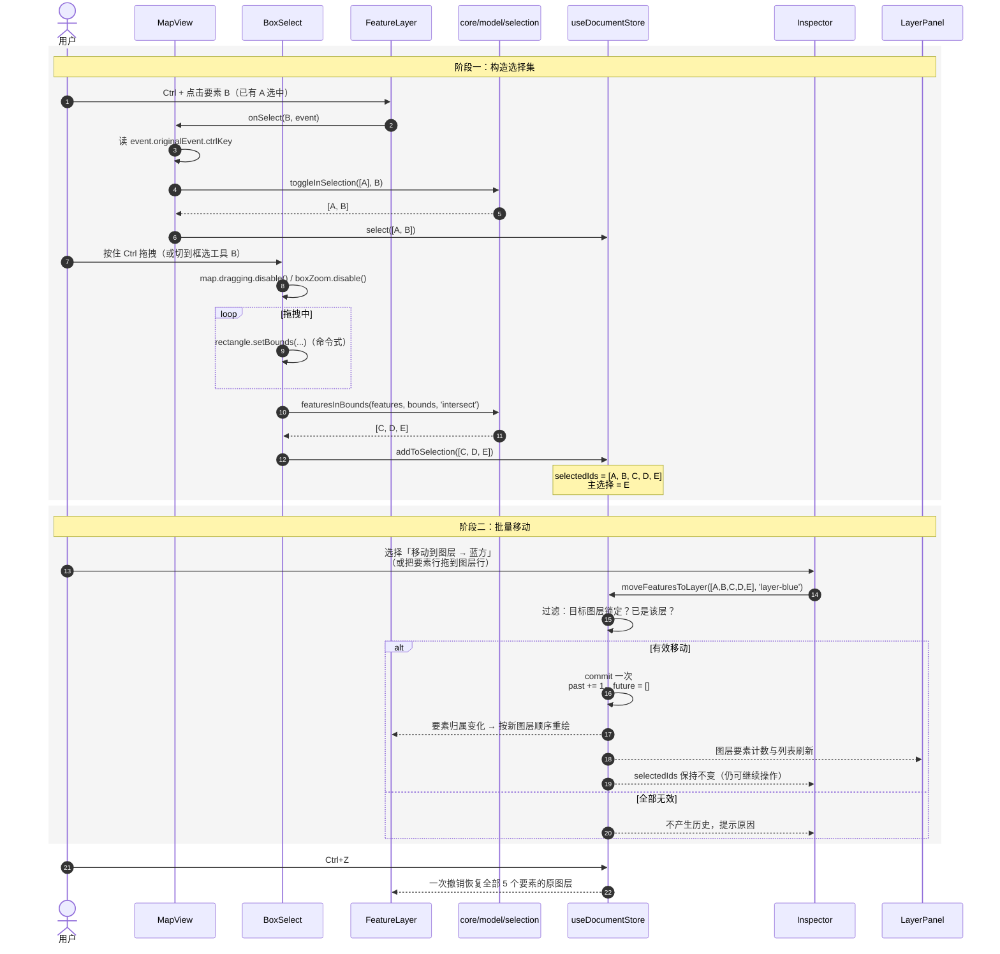
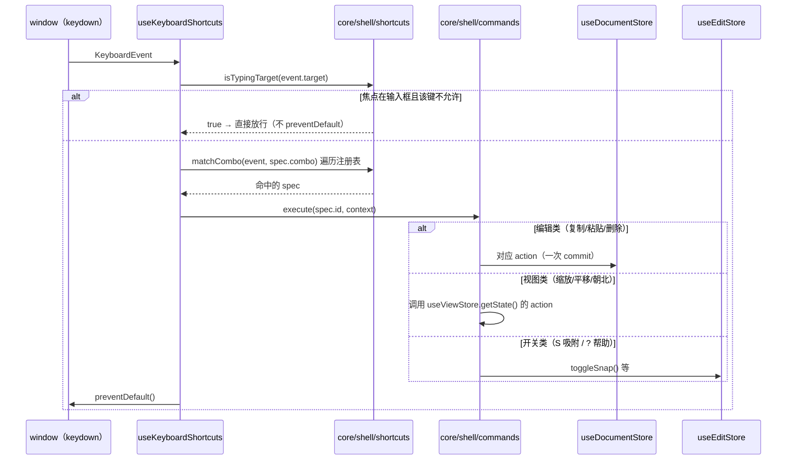

# 架构设计与任务分解：几何编辑与选择模型

> 文档类型：架构设计说明书（Architecture & Task Breakdown）
> 分支：`feature-geo-edit`（批次 1）
> 依据：`docs/PRD-roadmap-gap.md` R01–R61 与 §6 十二项拍板结论
> 编写人：高见远（架构师）
> 状态：待评审

---

## 0. 读前须知与基线

### 0.1 设计基线

本设计以仓库提交 **`90279fd`（docs: 补齐路线图差距的增量 PRD）** 的源码状态为基线：
`src/core/{geo,model,symbology,io}`、`src/features/{draw,inspector,io,layers,map,symbol,statusbar,toolbar}`、
`src/stores/{useDocumentStore,useViewStore}`，约 9900 行、219 条单测全绿。

> **实现前的强制前置检查**：编写本文件时，工作树 `git status` 出现大量 ` D`（已删除）条目，
> `src/core/geo`、`src/core/symbology`、`src/core/io`、`src/App.tsx`、`src/features/draw`、
> `src/features/inspector`、`src/features/io`、`src/features/map/{GridOverlay,MouseTracker,symbolIcon}` 等文件
> 在工作树中缺失。**开工前必须先恢复工作树**（`git restore .` 或重新 checkout），否则本批次所有任务无法编译。
> 本文档不执行任何 git 操作，仅作提示。

### 0.2 已核对的现状（依据基线提交）

| 现状 | 结论 |
| ---- | ---- |
| `Layer.opacity` 字段 | 已存在（`src/core/model/types.ts`） |
| 渲染层应用图层不透明度 | 已存在（`FeatureLayer` 传入 `layerOpacity`，`featureStyle.applyLayerOpacity` 叠加） |
| 图层重命名 / 拖拽排序 | 已存在（`LayerPanel` + `documentStore.moveLayer`，单次拖拽只提交一条历史） |
| `selectedIds: string[]` | 已存在，但**只按单元素使用**（`MapView` 取 `selectedIds[0]`，`FeatureLayer` 只收 `selectedId`） |
| 撤销栈 | `commit()` + `structuredClone` 全文档快照，`MAX_HISTORY = 100` |
| 顶点编辑 | 无，`DrawHandler` 只能整体重绘 |
| 吸附 / 剪贴板 / 多选 / 快捷键注册表 | 无 |

### 0.3 分层红线（本批次不得违反）

- `src/core/**` 不得 `import` 任何 `react` / `leaflet` / `src/features` / `src/stores` 内容；`core` 只依赖 `core`。
- `src/stores/**` 不得 `import` `leaflet`（吸附所需的投影能力通过**注入的接口**进入 `core`，见 §2.4 D5）。
- 视图状态与文档数据严格分离；本批次新增的**编辑瞬态**既不属于文档也不属于视图，单列一个 store（§2.4 D1）。
- 全部注释为简体中文，每个模块顶部有文件级职责说明，关键函数带 JSDoc。

---

# 第一部分：全局架构演进（覆盖 7 批）

## 1.1 分层与依赖方向



**依赖方向唯一**：`features → stores → core`，`core` 内部只允许 `model → geo`、`symbology → model`、`graphics → geo/model`、`io → model`。
`graphics` **不允许**依赖 `symbology`（详见 §1.3）。

## 1.2 数据模型演进与字段预留策略

### 1.2.1 预留三原则（后续批次必须遵守）

| 原则 | 适用场景 | 判据 |
| ---- | -------- | ---- |
| **P1 可选字段** | 语义为"缺省即默认值"，且不影响既有序列化 | 新增 `?` 字段，反序列化缺失时用默认值；**绝不新增必填字段**（会破坏既有 JSON 与 219 条单测） |
| **P2 独立子对象** | 一组"同生共死"、未来会整体扩展的字段 | 一次性建子对象（如 `modifiers`），后续**只加内部字段，不再平铺到根层** |
| **P3 平行数组** | 与既有数组元素一一对应的附加属性 | 新开 `xxx?: T[]`（如 `vertexBearings` 与 `geometry.points` 平行），**禁止**把属性塞进 `LonLat` |
| **P4 新增枚举成员** | 新增几何/图层种类 | 加入既有联合类型后，所有 `switch` 必须带 `default: assertNever(kind)` 并配编译期穷尽性检查 |

**反面清单（明令禁止）**：
1. 给 `LonLat` 加字段（会污染全部 codec 与几何算法）；
2. 在 `core/model/types.ts` 之外重复定义同类枚举（如再写一份 `GeometryKind`）；
3. 在 `MapFeature` 根层平铺 `strength` / `unitCode` / `platformCode` 一类同族字段（必须走 P2 的 `modifiers`）；
4. 用"时间窗口合并"实现撤销粒度（脆弱且不可单测，见 §2.4 D2）。

### 1.2.2 `MapFeature` 演进表

| 批次 | 新增 | 形态 | 预留理由 |
| ---- | ---- | ---- | -------- |
| **1** | `vertexBearings?: number[]` | P3 平行数组 | 与 `geometry.points` 等长；`undefined` = 自动切线方向。R22 方向重置即删除该位 |
| 2 | `symbolKind?: 'single' \| 'multiPoint'` | P1 | 区分普通符号与战术图形 |
| 2 | `graphicType?: TacticalGraphicType` | P1 | `'attackArrow' \| 'assemblyArea' \| 'boundary' \| 'corridor' \| 'phaseLine' \| …`；**多点符号不新增 GeometryKind**，它是 Line/Area 几何 + 特殊渲染，这样批次 1 的编辑框架无需改动 |
| 3 | `modifiers?: FeatureModifiers` | **P2 独立子对象** | 一次性收拢 R18 的兵力/部队代号/平台代号、R15 的 `modifierIcon1/2`。**本期不建空壳**，只通过 §1.2.4 的约定与 `migrate.ts` 的 v2 占位锁死形态 |
| 5 | `sourceRef?: SourceRef` | P2 | `{ codec: string; externalId?: string; raw?: Record<string,string> }`，KML/MilX/NVG 往返时保留外部属性不丢 |
| 6 | `CircleGeometry`（新几何种类） | P4 | `GeometryKind.Circle`，`{ kind:'circle'; center: LonLat; radius: number }`；R33 半径环 |
| 7 | 无 | — | 仅渲染与偏好层 |

> **R13 收藏夹不属于 `MapFeature`**：收藏的是**符号库条目**而非要素，落点为
> `core/symbology` 的符号元数据 `category/favorite` + `core/io/persistence` 的 `favorites` 存储键。
> 若把 `favorite` 加到要素上，会导致"同一符号的两个要素收藏状态不一致"的语义错误。

### 1.2.3 `Layer` 演进表

| 批次 | 新增 | 形态 | 说明 |
| ---- | ---- | ---- | ---- |
| **1** | `status?: LayerStatus` | P1 | `'working' \| 'approved'`，缺失 = `'working'`。R03 |
| **1** | `kind?: LayerKind` | P1 | `'feature' \| 'image' \| 'wargame'`，缺失 = `'feature'`。为 R53 图像叠加层预留 |
| **1** | `group?: string` | P1 | 为 R49 兵棋红/蓝方分组预留 |
| 2 | 无 | — | 符号库结构变化不涉图层 |
| 5 | `image?: ImageOverlayRef` | P2 | R53 真正落地：`{ dataUrl \| blobUrl, corners: [LonLat,LonLat,LonLat,LonLat] }` 四至配准 |
| 7 | 无 | — | — |

> **决策**：图像叠加层建模为 `Layer.kind === 'image'` 而非"图层集合之外的另一套资源集合"。
> 理由：图层已具备可见性 / 锁定 / 不透明度 / 排序 / 导出（R02）的全部语义，另起一套必然重复实现这些能力。

### 1.2.4 版本化与迁移

`MapDocument` 本期新增 `schemaVersion?: number`（缺失视为 `1`）。

- `src/core/model/migrate.ts` 提供**注册表式迁移链**：`registerMigration(from, to, fn)` / `migrateDocument(raw: unknown): MapDocument`。
- 本期只登记 `1 → 1` 的恒等迁移与骨架，**但必须建立**，否则批次 3（v2 引入 `modifiers`）、批次 5（URL 载荷里的老档）
  会各自手写兼容代码，最终演变成散落各处的 `if (feature.strength)` 判断。
- 迁移规则：`migrateDocument` 是所有反序列化入口（localStorage、文件导入、URL 载荷）的**唯一前处理**。

### 1.2.5 七个批次对模型的增量总表

| 批次 | 分支 | `MapFeature` | `Layer` | 新增 core 目录 | 新增 store |
| ---- | ---- | ------------ | ------- | -------------- | ---------- |
| 1 | `feature-geo-edit` | `vertexBearings` | `status` `kind` `group` | `core/shell` | `useEditStore` `useClipboardStore` `useSessionStore` |
| 2 | `feature-tactical-graphics` | `symbolKind` `graphicType` | — | `core/graphics` | — |
| 3 | `feature-symbol-modifiers` | `modifiers` | — | `core/symbology/anchors`（文本环绕布局） | `useOptionsStore`（工作模式） |
| 4 | `feature-export-print` | — | — | `core/io/print`（布局/world file/归属） | — |
| 5 | `feature-data-exchange` | `sourceRef` | `image`（`kind` 生效） | `core/io/codecs` `core/io/ir` `core/io/registry` `core/io/url` | — |
| 6 | `feature-map-tools` | `CircleGeometry` | — | `core/geo/{gars,wmm,gridLines,coordinateParser}` | `useViewStore` 扩展 |
| 7 | `feature-app-shell` | — | — | `core/i18n` `core/io/pwa` | `useOptionsStore` 扩展 |

**稳定性契约**（后续批次不得推翻）：
1. `MapFeature.geometry.points` 永远是 `LonLat[]`（顶点附加属性走平行数组）；
2. 一次用户手势 = 一条撤销记录（§2.4 D2）；
3. 所有序列化走 codec 注册表（§1.4），UI 不直接调用某个格式的 `serialize`；
4. 几何种类的 `switch` 必须编译期穷尽（§1.2.1 P4）。

## 1.3 `core/symbology` 与几何生成器的边界

这是批次 2（R09 战术图形）最大的架构风险点：**若把"箭头怎么算"写进符号引擎，符号引擎将同时依赖 SIDC、颜色和经纬度，彻底不可单测。**

**划界原则：**

| | `core/symbology`（既有） | `core/graphics`（批次 2 新增） |
| - | ------------------------ | ------------------------------ |
| 回答的问题 | **画什么**（符号语义与像素绘制） | **长什么样**（几何形状生成） |
| 输入 | SIDC + 文本修饰符 + 尺寸 | 控制点 `LonLat[]` + 参数（翼展比、宽度、分段） |
| 输出 | SVG 片段 / DivIcon | 纯几何：`{ outline: LonLat[]; parts?: LonLat[][]; anchors?: LonLat[] }` |
| 是否知道经纬度 | **否** | 是（依赖 `core/geo`） |
| 是否知道 SIDC / 颜色 | 是 | **否** |
| 可否独立单测 | 是 | 是（只断言坐标数值） |

**契约：**
```ts
// core/graphics —— 纯几何，不 import symbology
export type TacticalGraphicType =
  | 'attackArrow' | 'defenceLine' | 'assemblyArea' | 'boundary' | 'corridor' | 'phaseLine';

export interface GraphicGeometry {
  /** 主轮廓，供填充与命中测试 */
  outline: LonLat[];
  /** 附加笔画（如箭头内部羽线），逐段渲染 */
  parts?: LonLat[][];
  /** 可编辑控制点（编辑期手柄吸附到此） */
  anchors?: LonLat[];
}

/** 由控制点与参数生成渲染几何；纯函数、可逆、与控制点严格对应 */
export function buildGraphic(
  type: TacticalGraphicType,
  controlPoints: LonLat[],
  params?: GraphicParams,
): GraphicGeometry;
```

三点关键收益：
1. **批次 1 的编辑框架零改动**：编辑器只认 `points: LonLat[]` 与 `vertexBearings`，箭头只是"渲染时用 `buildGraphic` 再展开一次"；
2. 颜色/线型一律由 `symbology.paletteOf(sidc)` 决定，`graphics` 不产出样式 → 二者可并行开发、独立单测；
3. `buildGraphic` **可逆**（同控制点必得同几何），保证编辑顶点后重绘一致，不会出现"拖一次变一个样"。

## 1.4 `core/io` 序列化层抽象

批次 5 要同时承载 GeoJSON / MilX(`.milxly`) / MilX XML / KML / NVG / 图像叠加 / URL 载荷。
若各写一个"解析到 MapDocument"的函数，映射逻辑会重复 5 份。

### 1.4.1 三层结构



**IR（中间表示）定义要点**：
```ts
/** 交换格式的最小公分母：几何 + SIDC + 名称 + 文本修饰符 + 松散属性 */
export interface ExchangeFeature {
  id?: string;
  sidc: string;
  geometry: FeatureGeometry;
  name?: string;
  textFields?: FeatureTextFields;
  style?: FeatureStyle;
  direction?: number;
  vertexBearings?: number[];
  /** 目标格式无法映射的属性，原样带回，保证往返不丢 */
  extra?: Record<string, string>;
}
export interface ExchangeDocument {
  name?: string;
  layers: { id?: string; name: string; visible?: boolean; locked?: boolean; opacity?: number }[];
  features: (ExchangeFeature & { layerName?: string })[];
}
```
KML 与 NVG 共享同一映射层 → 新增格式的成本 = 只写 Raw 层。

### 1.4.2 Codec 注册表

```ts
export interface DocumentCodec<TOptions = unknown> {
  /** 稳定标识，用于注册表查找与 URL 参数 `fmt=` */
  readonly id: 'geojson' | 'milxly' | 'milx' | 'kml' | 'nvg' | 'url';
  readonly label: string;
  readonly extensions: string[];   // ['.json'] / ['.milx'] ...
  readonly mime: string;
  readonly canImport: boolean;
  readonly canExport: boolean;
  /** 导出粒度：整档 / 单图层（R02） */
  readonly scope: ('document' | 'layer')[];
  serialize(document: MapDocument, options?: TOptions): string | Blob;
  deserialize(input: string, options?: TOptions): ExchangeDocument;
}

export function registerCodec(codec: DocumentCodec): void;
export function getCodec(id: string): DocumentCodec;
export function listCodecs(filter?: { canImport?: boolean; scope?: 'layer' }): DocumentCodec[];
```

UI（`features/io/ImportExportBar`、图层右键菜单 R02）**只遍历注册表**，
批次 5 新增 KML/MilX/NVG 时 UI 零改动。本期只把既有 `geojson.ts` / `milxly.ts` 适配为 codec，不改行为。

### 1.4.3 分享链接（R46 / R48，批次 5 落地，本期锁死格式）

- 载荷 = `milxly` codec 输出 → `CompressionStream('deflate-raw')`（**浏览器原生，零依赖**）→ base64url → URL 片段 `#d=<payload>`。
- 三形态按拍板结论：`#d=…&mode=view`（只读，禁用编辑且隐藏编辑器）、`#d=…&mode=copy`（编辑副本，导入后立即转为本地文档，**不回写 URL**）；**`mode=overwrite` 明确不实现**。
- 本期在 `core/io/session.ts` 预留 `urlPayloadVersion` 常量，避免批次 5 出现无版本的载荷。

## 1.5 横切能力归属

| 能力 | `core`（纯逻辑，须有单测） | `stores`（状态） | `features`（交互） |
| ---- | -------------------------- | ---------------- | ------------------ |
| **多选** | `core/model/selection.ts`：集合增删/切换/差集纯函数、包围盒命中测试 | `useDocumentStore.selectedIds` + 8 个 action | `FeatureLayer` / `LayerPanel` 传递 `event.originalEvent.ctrlKey`；`BoxSelect` 框选 |
| **剪贴板** | `core/model/clipboard.ts`：载荷序列化 / 实例化（偏移、改名、换层） | `useClipboardStore`（payload + `pasteCount`） | 快捷键触发；`Inspector` 提供按钮 |
| **吸附** | `core/geo/snap.ts`（依赖注入的 `Projection`）+ `core/model/spatialIndex.ts`（分桶） | `useEditStore`（开关、阈值、候选集、预览点） | `features/map/leafletProjection.ts` 提供适配器 |
| **快捷键** | `core/shell/shortcuts.ts`：注册表数据 + `matchCombo` / `isTypingTarget` 纯函数 | 无（通过 `getState()` 直调 action） | `features/shell/useKeyboardShortcuts.ts` + `ShortcutHelp` 面板 |
| **命令** | `core/shell/commands.ts`：命令注册表，形如 `(ctx) => void` 的纯组合函数 | 无 | 快捷键与按钮**共用同一命令**，避免两套实现走偏 |
| **撤销/重做** | — | `useDocumentStore.commit` / 手势事务（§2.4 D2） | 工具栏按钮 + 快捷键 |

> 决策：**不引入命令总线 / 事件总线**。命令就是普通函数，由快捷键注册表和按钮共同引用。
> 引入总线会让 `core` 依赖调度器，且难以单测。

---

# 第二部分：批次 1 `feature-geo-edit` 详细设计

覆盖需求：**R19 R20 R21 R22 R23 R24 R01 R03 R04 R05 R55**

## 2.1 需求—现状—缺口对照

| 需求 | 现状 | 本批要做 |
| ---- | ---- | -------- |
| R19 顶点增删改移 | 只能整体重绘 | `core/model/vertex.ts` 纯函数 + `VertexEditor` 手柄层 |
| R20 N 点键位 | 无 | Ctrl 插入 / Shift 删除 / Ctrl+←→ 切换当前点 |
| R21 顶点吸附 | 无 | `core/geo/snap.ts` + 三源候选 + 10px 阈值可配 + S 键开关 |
| R22 方向重置 | 无 | `vertexBearings` + 「重置方向」命令 |
| R23 复制粘贴 | 无 | `core/model/clipboard.ts` + `useClipboardStore` + 像素偏移 |
| R24 多选 | 单选 | `selectedIds` 升为一等公民 + Ctrl 点击 / Ctrl 框选 / 批量面板 |
| R01 会话持久化增强 | 已有 localStorage 自动保存 | 配额与冲突提示、恢复入口、`useSessionStore` |
| R03 图层状态 | 无 | `Layer.status` + 徽标与切换 |
| R04 跨图层移动 | 无 | `moveFeaturesToLayer` 批量 action + 拖放 + 检查器下拉 |
| R05 图层透明度 | **已实现** | 只补缺口：见 §2.2 核对清单 |
| R55 快捷键 | 零散 | 统一注册表 + 帮助面板 |

### 2.1.1 R05 开工前核对清单（实现者逐条确认，已实现项跳过）

- [ ] 图层面板是否已有不透明度滑块？若无 → 补 `<input type="range">`（0.05–1，步进 0.05）。
- [ ] 拖动滑块是否产生 N 条撤销记录？若是 → 收敛为 1 条（§2.4 D2 手势事务）。
- [ ] `opacity` 为 0 时要素是否仍可点选？若是 → 约定最小值 0.05，且 `< 0.05` 时不参与命中测试。
- [ ] 点符号（DivIcon）是否随图层不透明度变淡？若 Marker `opacity` 未生效 → 改用 CSS `opacity` 于图标根节点。
- [ ] 不透明度是否随文档持久化？`Layer.opacity` 已在模型内 → 应已自动持久化，验证一次。

## 2.2 关键决策（D1–D12）

### D1 顶点编辑的瞬态状态放哪 —— **新建 `useEditStore`，拖拽期完全不入 `documentStore`**

三段式拆分：

| 数据 | 归属 | 理由 |
| ---- | ---- | ---- |
| 顶点坐标的**最终结果** | `useDocumentStore.document` | 必须可撤销、可持久化 |
| 拖拽**会话态**（正在拖的要素与顶点序号、活动顶点、吸附候选集、吸附预览点、框选矩形、拖拽中标志） | `useEditStore`（新） | 每帧变化；进文档会造成 O(n) 克隆 + 撤销栈污染 |
| 拖拽中的**视觉更新** | **不进任何 store**，命令式调 Leaflet 图层 `setLatLngs` | 2000 要素下每帧 setState 必然掉帧 |

拖拽期渲染方案：
- 进入编辑态时，被编辑要素本体**隐藏**，`VertexEditor` 渲染一条"幽灵图形"（`L.Polyline` / `L.Polygon`，保存 ref）；
- `drag` 中只做 `ghost.setLatLngs(next)` + 手柄 `setLatLng`，**零 React 渲染**；
- 吸附预览点仅在"吸附目标发生变化"时写入 `useEditStore`（低频，可用值比较守卫）；
- `dragend` 写入一次 `documentStore`，触发一次 React 渲染。

### D2 撤销栈粒度 —— **手势事务（Gesture Transaction），而非时间窗口合并**

在 `useDocumentStore` 增加三个内部能力：

```ts
/** 开启一次手势：把当前文档快照暂存，不进 past */
beginGesture(): void;
/** 结束手势：若期间有过 preview 修改，把暂存快照压入 past（= 一条历史） */
endGesture(): void;
/** 手势内的预览写入：改 document，不动 past/future */
previewFeatureGeometry(id: string, points: LonLat[], bearings?: number[]): void;
previewLayer(id: string, patch: Partial<Layer>): void;
```

语义表：

| 场景 | 调用序列 | 历史条数 |
| ---- | -------- | -------- |
| 顶点拖拽 | `dragstart: beginGesture` → N×`previewFeatureGeometry` → `dragend: endGesture` | **1** |
| 不透明度滑块 | `pointerdown: beginGesture` → N×`previewLayer` → `pointerup: endGesture` | **1** |
| 插入 / 删除顶点、复制粘贴、批量移动 | 直接调 commit 版 action（内部 = begin + preview + end） | 1 |
| 无实际变化的手势（点一下没动） | begin → 无 preview → end | **0**（`endGesture` 检测无修改则丢弃快照） |

- **红线**：`mousemove` / `input` / `dragover` 处理器中**禁止出现任何 commit 版 action**；
  以单测断言 `past.length` 增量保证（见 T14 验收）。
- 明确反对"距上次提交 <300ms 就合并"的时间窗方案：时序依赖、不可单测、快速连点时行为诡异。

### D3 多选如何贯穿 store 与渲染层

- `selectedIds: string[]` 升级为**一等公民**，并定义**顺序语义**：数组末位为**主选择（primary）**。
  - 检查器表单编辑主选择；批量修改以主选择为模板；`Enter` 把主选择提升为独占选择并进入点编辑。
  - 多选（>1）时**不显示顶点手柄**（避免手柄互相压盖），只做高亮；单选手柄全显。
- 新增 action：`toggleSelect(id)` / `addToSelection(ids)` / `removeFromSelection(ids)` /
  `clearSelection()` / `selectAll()` / `selectInBounds(bounds, mode)`。
- 选择器引用稳定性：zustand 5 下返回新数组必须用 `useShallow`（`zustand/react/shallow`）。
  新增 `useSelectedFeatures()`（返回 `MapFeature[]`）与 `usePrimaryFeature()`（替代 `useSelectedFeature()`，保留旧名做 deprecated 别名一个批次）。
- 渲染层：`FeatureLayer` 的 `selectedId?: string | null` → `selectedIds?: string[]`（内部构 `Set` 一次，不逐要素 `includes`）；
  `onSelect` 签名改为 `(id: string, event: L.LeafletMouseEvent) => void`，由 `MapView` 依据
  `event.originalEvent.ctrlKey || metaKey` 决定**替换**还是**增减**。
- `LayerPanel` 要素列表同样支持 Ctrl（增减）与 Shift（连续区间）。

### D4 框选实现 —— 自研，零新增依赖

- 不引入 `leaflet-draw` / `leaflet-editable`（违反"优先零新增依赖"）。
- **主路径**：工具栏「框选」按钮 + 快捷键 `B` 切换 `activeTool === Tool.BoxSelect`；
  **附加路径**：选择工具下 `Ctrl/Cmd + 拖拽` 临时进入框选。
- 交互：`mousedown` → `map.dragging.disable()` + `map.boxZoom.disable()` + 记录起点；
  `mousemove` → 更新 `L.Rectangle`（命令式，不进 store）；`mouseup` → 计算 `Bounds` → `selectInBounds`；
  拖拽位移 < 5px 视为普通点击（清空选择）。
- 命中判定下沉为 `core` 纯函数：
  ```ts
  export type SelectMode = 'inside' | 'intersect';
  export function hitTestBounds(feature: MapFeature, bounds: Bounds, mode: SelectMode): boolean;
  ```
  语义：点要素用 `inside`（中心在框内）；线/面用 `intersect`（任一点在框内 **或** 要素包围盒与框相交）。
  框选默认 `intersect`，Ctrl 框选为**追加**（与已有选择求并）。
- macOS 下 `Ctrl+拖拽` 会触发右键菜单 → 在地图容器上阻止 `contextmenu`（仅框选期间）。

### D5 吸附的经纬度 ↔ 像素换算 —— **依赖注入 `Projection`，core 不碰 Leaflet**

阈值以**屏幕像素**定义（默认 10px），候选点以**经纬度**存储。
Web Mercator 下同一像素距离对应的经度差随纬度变化，**禁止**使用 `lon += dx * 360 / 256 / 2**zoom` 这类魔数。

```ts
// core/geo/snap.ts —— 只依赖注入的接口，可在恒等投影下单测
export interface Projection {
  toPixel(point: LonLat): Pixel;   // { x: number; y: number }
  toLonLat(pixel: Pixel): LonLat;
}

export type SnapSource = 'self' | 'feature' | 'grid';
export interface SnapCandidate {
  point: LonLat;
  source: SnapSource;
  /** 来源要素与顶点序号，用于排除自身被拖顶点 */
  featureId?: string;
  index?: number;
}
export interface SnapResult {
  /** 吸附后的最终坐标（已换算回经纬度） */
  point: LonLat;
  source: SnapSource;
  /** 命中时的像素距离，供 UI 显示强度提示 */
  distancePx: number;
  /** 命中的候选，用于绘制吸附指示 */
  candidate: SnapCandidate;
}

export interface SnapOptions {
  /** 阈值（像素），默认 SNAP_THRESHOLD_PX = 10 */
  thresholdPx: number;
  enabled: boolean;
  /** 启用的吸附源，默认全部 */
  sources?: SnapSource[];
  /** 需要排除的候选（自身正在拖的顶点） */
  exclude?: { featureId: string; index: number };
}

export function snapPoint(
  origin: LonLat,
  candidates: readonly SnapCandidate[],
  options: SnapOptions,
  projection: Projection,
): SnapResult | null;
```

- `features/map/leafletProjection.ts` 提供 `createLeafletProjection(map)`：
  `toPixel = map.latLngToLayerPoint`、`toLonLat = map.layerPointToLatLng`（`layerPoint` 而非 `containerPoint`，
  避免地图平移导致基准漂移）。
- **候选集构建时机**：`dragstart` / 进入编辑态时构建一次并存 `useEditStore`，拖拽中只读。
  构建成本 O(n)，先用**视口裁剪**；`core/model/spatialIndex.ts` 本期提供最小实现（均匀网格分桶，cell ≈ 64px），
  候选集上限 `MAX_SNAP_CANDIDATES = 2000` 触发降级（只保留自身要素 + 视口内网格）。
  完整的渲染级空间索引留到批次 7（R59）与 Canvas 分层一起做，避免本期过度设计。
- 三源含义：`self` = 被编辑要素的其他顶点；`feature` = 其他**可见且未锁定**图层的要素顶点；
  `grid` = 当前激活军网（MGRS / UTM / BNG）在视口内的网格线交点（数量上限 400；网格关闭则跳过）。
  按 Q7 拍板，本期**不含** GARS / WGS84 经纬网（批次 6 加入时只需在候选生成器里加一个分支）。
- 优先级：距离相同时按 `self > feature > grid` 排序。
- `S` 键切换 `useEditStore.snapEnabled`；阈值在选项面板可调（持久化到 localStorage），默认 10px。

### D6 顶点方向与重置（R22）

- 保持 `points: LonLat[]` 不变，方向存**平行数组** `MapFeature.vertexBearings?: number[]`
  （度，真北顺时针 0–360，`undefined` = 自动切线方向）。
- 默认切线由 `core/model/geometry.ts` 既有的 `bearingOf` 计算：
  ```ts
  export function defaultBearingAt(points: LonLat[], index: number): number;
  ```
  首点取"指向次点"，末点取"倒数次点指向末点"，中间点取前后方位角均值。
- 「重置方向」命令 = 删除 `vertexBearings[index]`；「重置全部方向」= 删除整个字段。
  纯函数返回新数组，不改变数组长度语义（`undefined` 占位而非 `splice`，保持与 `points` 对齐）。
- **为批次 2 预留**：箭头/走廊的翼展方向直接消费 `vertexBearings`，批次 2 不改动批次 1 的编辑框架。

### D7 剪贴板（R23）

```ts
export interface ClipboardPayload {
  kind: 'map-army/clipboard';
  version: 1;
  /** 复制瞬间的要素深拷贝（保留 layerId 仅用于"同层粘贴"还原） */
  features: MapFeature[];
  /** 图层名快照，跨文档粘贴时用于提示 */
  layerNames: Record<string, string>;
  /** 复制时的视图缩放，用于把像素偏移换算成经纬度偏移 */
  zoom: number;
  anchor: LonLat;
}
```

- 粘贴偏移：**以像素定义**（默认 24px，右下方），由 `Projection` 换算为经纬度，保证任何缩放下"肉眼可见地错开"。
  连续粘贴按 `pasteCount` 递增（24 × n px），避免叠在原处。
- `materializeClipboard(payload, { targetLayerId, projection, offsetPx })`：新 id、`layerId = targetLayerId`、
  名称加 `副本` / `(2)` 后缀、`createdAt/updatedAt` 刷新、几何整体平移。
- **不劫持系统剪贴板**：`navigator.clipboard.writeText` 需权限且对结构化数据无意义；
  采用内存（`useClipboardStore`）+ localStorage 兜底（复用 `core/io/persistence` 的命名空间与配额处理）。
  同时监听原生 `paste` 事件以兼容"页面失焦时 Ctrl+V 不触发 keydown"的情况。

### D8 快捷键注册表（R55）

```ts
// core/shell/shortcuts.ts —— 纯数据 + 纯匹配，可单测
export interface ShortcutSpec {
  id: string;                       // 'edit.copy'
  /** 组合键描述：'Ctrl+C' / 'Ctrl+ArrowLeft' / 'F11' / 'Z' / 'Shift+Delete' */
  combo: string;
  /** 显示用分组，供帮助面板分区 */
  group: '文档' | '编辑' | '选择' | '视图' | '应用';
  description: string;
  /** 是否允许在输入框聚焦时生效（如 Esc 始终生效） */
  allowInInput?: boolean;
}
export function matchCombo(event: KeyEventLike, combo: string): boolean;
export function isTypingTarget(target: EventTarget | null): boolean;
export function findConflicts(specs: readonly ShortcutSpec[]): string[];
```

覆盖键位（R55 要求的全部）：

| 键位 | 命令 | 键位 | 命令 |
| ---- | ---- | ---- | ---- |
| `Ctrl+Z` / `Ctrl+Shift+Z` | 撤销 / 重做 | `Ctrl+C` / `Ctrl+V` | 复制 / 粘贴 |
| `Delete` | 删除选中 | `Ctrl+A` | 全选当前图层 |
| `Esc` | 取消选择 / 退出编辑 | `F11` | 全屏（失败降级 `Alt+Enter`，见 §2.9 风险 4） |
| `Ctrl+F5` | 强制重载 | `Z` / `X` | 缩放 +1 / -1 |
| 方向键 | 平移地图 | `N` | 重置朝北（bearing → 0） |
| `Space` | 确认当前绘制 / 结束编辑 | `S` | 切换吸附开关 |
| `Ctrl` + 点击 | 插入顶点 | `Shift` + 点击手柄 | 删除顶点 |
| `Ctrl+←/→` | 切换当前活动顶点 | `B` | 框选工具 |
| `Ctrl+Shift+V`? | 不设，粘贴即偏移粘贴 | `?` | 快捷键帮助面板 |

- `findConflicts` 在单测中断言**无重复 combo**，从源头杜绝键位打架。
- `allowInInput` 默认 false：命中 `input` / `textarea` / `[contenteditable]` 时全部豁免（`Esc` 除外）。

### D9 会话持久化增强（R01）

`core/io/session.ts` 纯逻辑（可单测）：

```ts
export const STORAGE_KEY = 'map-army.session.v1';
export const QUOTA_WARN_BYTES = 4 * 1024 * 1024;   // 接近配额时提前告警

export function estimateBytes(value: unknown): number;
export type SessionErrorKind = 'quota' | 'corrupt' | 'conflict' | 'unavailable' | 'unknown';
export function classifyError(error: unknown): SessionErrorKind;
export interface SessionMeta { savedAt: number; appVersion: string; tabId: string; featureCount: number; }
export function isConflict(meta: SessionMeta | null, now?: number): boolean; // 其他标签页 30s 内写过
```

- 冲突检测：`storage` 事件 + 每条会话记录 `tabId`；启动时若发现**其他 tabId** 在 30 秒内写入 → 提示"另一标签页正在编辑本图，同时编辑可能导致覆盖"。
- 超限：`classifyError` 识别 `QuotaExceededError`（含 Safari 私有变体）→ 提示"自动保存失败：浏览器存储已满，请导出 `.milxly` 保存副本"。
- 损坏：`JSON.parse` 失败或 `migrateDocument` 抛错 → 保留原始串到 `…v1.bak`，提示"检测到损坏的会话，已备份，可恢复或丢弃"。
- 恢复入口：`SessionBanner` 顶部横幅 —— 「检测到上次会话（2 小时前，12 个要素）· 恢复 / 丢弃」。
- 状态集中在 `useSessionStore`，**不污染** `useDocumentStore`。

### D10 R03 / R04 / R05 的落地

- `Layer.status?: 'working' | 'approved'`（缺失 = working）。UI：图层名左侧徽标（草稿 / 已核定），点击切换。
  语义扩展留白：`approved` 图层后续可加"编辑需确认"，本期只做标记。
- 跨图层批量移动：`moveFeaturesToLayer(ids: string[], layerId: string)`，**一次 commit**；
  内部过滤"目标图层锁定"与"原地不动"的情况（无变化则不产生历史）。
  入口有二：检查器「移动到图层…」下拉；图层面板拖放（拖拽要素行 → 落到图层行，复用已有的 HTML5 DnD 基础设施）。
- R05 见 §2.1.1 核对清单。

### D11 `schemaVersion` 与迁移骨架

本期加入 `MapDocument.schemaVersion?: number`（缺失 = 1）与 `core/model/migrate.ts` 的恒等迁移，
为批次 3 / 5 预留唯一兼容入口（§1.2.4）。

### D12 编辑态进入/退出规则

```mermaid
stateDiagram-v2
    [*] --> 空闲: 初始
    空闲 --> 已选中: 点击要素 / 列表点选
    已选中 --> 点编辑: 单选 且 Select 工具 且 图层未锁定
    已选中 --> 多选态: Ctrl/Shift 点击 或 框选 得到 >1 个
    多选态 --> 点编辑: Enter（主选择提升为独占）
    点编辑 --> 已选中: Esc / 点击空白处
    已选中 --> 空闲: Esc / 点击空白处
    点编辑 --> 空闲: 删除要素
    多选态 --> 空闲: Esc
```



- 进入点编辑的条件：`selectedIds.length === 1 && activeTool === Tool.Select && !layer.locked && layer.visible`。
- 多选态只高亮**不出手柄**；`Enter` 或双击主选择 → 提升为独占并进入点编辑。

## 2.3 文件清单

### 2.3.1 新增（26 个）

**`src/core/` —— 纯逻辑 + 单测（17 个）**

| # | 文件 | 职责 |
| - | ---- | ---- |
| 1 | `src/core/model/vertex.ts` | 顶点插入/删除/移动、边上最近点、默认切线方位角、顶点合法性校验 |
| 2 | `src/core/model/vertex.test.ts` | 上述纯函数单测（含不可变性与边界） |
| 3 | `src/core/model/selection.ts` | 选择集合切换/增减/差集纯函数、包围盒命中测试 |
| 4 | `src/core/model/selection.test.ts` | 选择集合与命中测试单测 |
| 5 | `src/core/model/clipboard.ts` | 剪贴板载荷序列化与实例化（换层、偏移、改名） |
| 6 | `src/core/model/clipboard.test.ts` | 复制粘贴往返与偏移递增单测 |
| 7 | `src/core/model/spatialIndex.ts` | 屏幕空间均匀网格分桶，用于吸附候选集裁剪（最小可用实现） |
| 8 | `src/core/model/spatialIndex.test.ts` | 分桶与查询正确性单测 |
| 9 | `src/core/model/migrate.ts` | `schemaVersion` 迁移链注册表与 `migrateDocument` |
| 10 | `src/core/model/migrate.test.ts` | 缺失版本、未知版本、链式迁移单测 |
| 11 | `src/core/geo/snap.ts` | 吸附引擎：`Projection` 接口、候选评估、优先级与阈值 |
| 12 | `src/core/geo/snap.test.ts` | 恒等投影下的吸附命中/不命中/排除自身单测 |
| 13 | `src/core/shell/shortcuts.ts` | 快捷键注册表数据与 `matchCombo` / `isTypingTarget` / `findConflicts` |
| 14 | `src/core/shell/shortcuts.test.ts` | 组合键匹配、输入框豁免、冲突检测单测 |
| 15 | `src/core/shell/commands.ts` | 命令注册表：复制、粘贴、删除、全选、重置方向、移动到图层等纯组合函数 |
| 16 | `src/core/io/session.ts` | 存储配额估算、错误分类、冲突检测、URL 载荷版本常量 |
| 17 | `src/core/io/session.test.ts` | 配额估算、错误分类、冲突判定单测 |

**`src/stores/` —— 状态容器（3 个）**

| # | 文件 | 职责 |
| - | ---- | ---- |
| 18 | `src/stores/useEditStore.ts` | 编辑瞬态：编辑会话、活动顶点序号、拖拽中标志、吸附开关/阈值/候选集/预览点、框选矩形 |
| 19 | `src/stores/useClipboardStore.ts` | 剪贴板载荷、粘贴计数、localStorage 兜底读写 |
| 20 | `src/stores/useSessionStore.ts` | 自动保存状态、最后保存时间、错误信息、待恢复会话 |

**`src/features/` —— 界面（6 个）**

| # | 文件 | 职责 |
| - | ---- | ---- |
| 21 | `src/features/draw/VertexEditor.tsx` | 顶点手柄层：渲染手柄、幽灵图形、拖拽、Ctrl 插入、Shift 删除、方向重置入口 |
| 22 | `src/features/map/leafletProjection.ts` | `Projection` 的 Leaflet 适配器 + 像素/经纬度工具（唯一允许做换算的地方） |
| 23 | `src/features/map/BoxSelect.tsx` | 框选矩形交互（工具模式与 Ctrl 拖拽双路径） |
| 24 | `src/features/shell/useKeyboardShortcuts.ts` | 全局键盘监听 hook，消费注册表与命令注册表 |
| 25 | `src/features/shell/ShortcutHelp.tsx` | 快捷键帮助面板（`?` 打开），直接渲染注册表 |
| 26 | `src/features/shell/SessionBanner.tsx` | 会话恢复入口与自动保存异常横幅（R01） |

### 2.3.2 修改（15 个）

| # | 文件 | 改动要点 |
| - | ---- | -------- |
| 1 | `src/core/model/types.ts` | 新增 `LayerStatus` / `LayerKind`；`Layer.{status,kind,group}`；`MapFeature.vertexBearings`；`MapDocument.schemaVersion`；`Tool.BoxSelect` |
| 2 | `src/core/model/index.ts` | 导出新增模块与类型 |
| 3 | `src/core/model/factory.ts` | `createLayer` 填默认 `status/kind`；`createDocument` 写 `schemaVersion`；`cloneFeature` 复制 `vertexBearings` |
| 4 | `src/core/io/persistence.ts` | 接入 `session.ts` 的错误分类与配额告警；保存/读取前过 `migrateDocument` |
| 5 | `src/core/io/index.ts` | 导出 `session` |
| 6 | `src/stores/useDocumentStore.ts` | 手势事务（`beginGesture`/`endGesture`/`preview*`）、选择 action 组、`moveFeaturesToLayer`、`applyGeometry`、`moveVertex` 等 |
| 7 | `src/stores/useViewStore.ts` | 新增 `shortcutHelpOpen` 与 `setShortcutHelpOpen`（帮助面板开合） |
| 8 | `src/features/map/FeatureLayer.tsx` | `selectedId` → `selectedIds: string[]`；`onSelect` 携带原始事件；内部用 `Set` 判选中；几何 `switch` 加 `assertNever` |
| 9 | `src/features/map/MapView.tsx` | 组装 `VertexEditor` / `BoxSelect`；多选点击语义；`useShallow` 选择集 |
| 10 | `src/features/layers/LayerPanel.tsx` | 状态徽标与切换、不透明度滑块（手势事务）、要素拖放接收、Ctrl/Shift 多选、批量移动入口 |
| 11 | `src/features/inspector/Inspector.tsx` | 多选批量面板（N 个已选）、「移动到图层…」、顶点方向重置、`key={primaryId}` 防输入跳变 |
| 12 | `src/features/draw/DrawHandler.tsx` | 绘制期复用吸附引擎；几何 `switch` 加 `assertNever` |
| 13 | `src/features/map/featureStyle.ts` | 视核对结果：补齐多选高亮态与不透明度叠加（若 HEAD 版本已具备则跳过） |
| 14 | `src/App.tsx` | 挂载 `useKeyboardShortcuts`、`SessionBanner`、`ShortcutHelp` |
| 15 | `src/styles/global.css` | 顶点手柄、幽灵图形、吸附指示、状态徽标、横幅、帮助面板样式 |

## 2.4 数据结构与接口

### 2.4.1 模型增量（`src/core/model/types.ts`）

```ts
/** 图层工作状态（R03） */
export const LayerStatus = {
  /** 草稿：正在标绘 */
  Working: 'working',
  /** 已核定：审校通过 */
  Approved: 'approved',
} as const;
export type LayerStatus = (typeof LayerStatus)[keyof typeof LayerStatus];

/** 图层种类，为图像叠加层（R53）与兵棋分组（R49）预留 */
export const LayerKind = {
  Feature: 'feature',
  Image: 'image',
  Wargame: 'wargame',
} as const;
export type LayerKind = (typeof LayerKind)[keyof typeof LayerKind];

export interface Layer {
  id: string;
  name: string;
  visible: boolean;
  locked: boolean;
  opacity: number;
  order: number;
  /** 工作状态，缺省视为 working（R03） */
  status?: LayerStatus;
  /** 图层种类，缺省视为 feature（为 R53/R49 预留，本期不产生分支逻辑） */
  kind?: LayerKind;
  /** 兵棋分组标识，如 'red' / 'blue'（为 R49 预留） */
  group?: string;
}

export interface MapFeature {
  id: string;
  layerId: string;
  sidc: string;
  name: string;
  geometry: FeatureGeometry;
  textFields: FeatureTextFields;
  style?: FeatureStyle;
  direction?: number;
  /**
   * 逐顶点方向（度，真北顺时针 0–360），与 geometry.points **一一对应**（R22）。
   * 稀疏语义：该位为 undefined 表示"自动切线方向"。
   * 之所以用平行数组而非把方位塞进 LonLat，是因为 LonLat 贯穿全部
   * 序列化格式与几何算法，改动会波及所有 codec 与既有单测。
   */
  vertexBearings?: number[];
  createdAt: number;
  updatedAt: number;
}

export interface MapDocument {
  name: string;
  layers: Layer[];
  features: MapFeature[];
  createdAt: number;
  updatedAt: number;
  /** 模型结构版本，缺失视为 1；所有反序列化入口统一走 core/model/migrate */
  schemaVersion?: number;
}
```

`Tool` 新增成员：

```ts
export const Tool = {
  Select: 'select',
  Symbol: 'symbol',
  Line: 'line',
  Area: 'area',
  Measure: 'measure',
  Delete: 'delete',
  /** 框选（R24） */
  BoxSelect: 'boxSelect',
} as const;
```

### 2.4.2 顶点纯函数（`src/core/model/vertex.ts`）

```ts
/** 顶点操作的最小合法点数：线 2，面 3 */
export function minVertexCountOf(kind: GeometryKind): number;

/** 在 index 处插入顶点（index 为插入后位置；在边上插入时先取最近边） */
export function insertVertex(
  points: LonLat[], index: number, point: LonLat,
  bearings?: number[],
): { points: LonLat[]; bearings: number[] | undefined };

/** 移动顶点，返回新数组（不可变） */
export function moveVertex(points: LonLat[], index: number, point: LonLat): LonLat[];

/** 删除顶点；低于最小点数时返回 null（调用方应拒绝而非产生非法几何） */
export function deleteVertex(points: LonLat[], index: number, minCount: number): LonLat[] | null;

/** 与顶点数组等长地删除方向位（reset 语义：置 undefined，不 splice） */
export function resetBearing(bearings: number[] | undefined, index: number): number[] | undefined;
export function resetAllBearings(bearings: number[] | undefined): undefined;

/** 默认切线方位角：首/末点取相邻方向，中间点取前后均值 */
export function defaultBearingAt(points: LonLat[], index: number): number;

/** 命中最近顶点；超出 maxPx 返回 null */
export function nearestVertex(
  points: LonLat[], target: LonLat, projection: Projection, maxPx: number,
): number | null;

/** 命中最近边，返回建议插入位置与投影点（Ctrl 插入点的依据） */
export function nearestSegment(
  points: LonLat[], target: LonLat, projection: Projection, maxPx: number,
): { index: number; point: LonLat } | null;

/** 循环步进（Ctrl+←/→ 在首尾间环绕） */
export function stepVertex(index: number, delta: number, length: number): number;
```

### 2.4.3 选择与剪贴板（`src/core/model/selection.ts` / `clipboard.ts`）

```ts
// selection.ts
export function toggleInSelection(ids: readonly string[], id: string): string[];
export function addToSelection(ids: readonly string[], added: readonly string[]): string[];
export function removeFromSelection(ids: readonly string[], removed: readonly string[]): string[];
export type SelectMode = 'inside' | 'intersect';
export function hitTestBounds(feature: MapFeature, bounds: Bounds, mode: SelectMode): boolean;
export function featuresInBounds(
  features: readonly MapFeature[], bounds: Bounds, mode: SelectMode,
): string[];
/** 列表内 Shift 连续区间选择 */
export function rangeSelection(allIds: readonly string[], anchorId: string, targetId: string): string[];

// clipboard.ts
export interface ClipboardPayload { /* 见 §2.2 D7 */ }
export interface MaterializeParams {
  targetLayerId: string;
  projection: Projection;
  /** 粘贴偏移（像素），默认 24 × pasteCount */
  offsetPx?: Pixel;
  pasteCount?: number;
}
export function serializeClipboard(
  features: readonly MapFeature[], layerNames: Record<string, string>,
  anchor: LonLat, zoom: number,
): ClipboardPayload;
export function parseClipboard(raw: string | null): ClipboardPayload | null;
export function materializeClipboard(
  payload: ClipboardPayload, params: MaterializeParams,
): MapFeature[];
```

### 2.4.4 编辑瞬态 store（`src/stores/useEditStore.ts`）

```ts
export interface EditState {
  /** 正在进行的顶点拖拽；null 表示空闲 */
  drag: { featureId: string; index: number; startPoints: LonLat[] } | null;
  /** 当前活动顶点序号（Ctrl+←/→ 切换、键位增删的目标） */
  activeVertex: number | null;
  /** 吸附总开关（S 键） */
  snapEnabled: boolean;
  /** 吸附阈值（像素），默认 10 */
  snapThresholdPx: number;
  /** 拖拽前预构建的候选集（经纬纬度） */
  snapCandidates: SnapCandidate[];
  /** 当前吸附结果，仅用于绘制指示；值比较守卫避免高频更新 */
  snapPreview: SnapResult | null;
  /** 框选拖拽中的屏幕矩形（左上角与右下角经纬度） */
  boxSelect: { a: LonLat; b: LonLat } | null;

  beginDrag: (featureId: string, index: number, startPoints: LonLat[]) => void;
  endDrag: () => void;
  setActiveVertex: (index: number | null) => void;
  toggleSnap: () => void;
  setSnapThresholdPx: (px: number) => void;
  setSnapCandidates: (candidates: SnapCandidate[]) => void;
  setSnapPreview: (result: SnapResult | null) => void;
  setBoxSelect: (box: { a: LonLat; b: LonLat } | null) => void;
}
```

### 2.4.5 文档 store 增量（`src/stores/useDocumentStore.ts`）

```ts
export interface DocumentState {
  // …既有字段与 action 保持不变…

  // ── 手势事务（撤销粒度保证，见 §2.2 D2） ──────────────
  beginGesture: () => void;
  endGesture: () => void;
  previewFeatureGeometry: (id: string, points: LonLat[], bearings?: number[]) => void;
  previewLayer: (id: string, patch: Partial<Layer>) => void;

  // ── 几何编辑（R19 / R22） ──────────────────────────────
  /** 一次手势 = 一条历史；拖拽结束时调用 */
  applyGeometry: (id: string, points: LonLat[], bearings?: number[]) => void;
  insertVertexAt: (id: string, index: number, point: LonLat) => void;
  deleteVertexAt: (id: string, index: number) => void;
  resetVertexBearing: (id: string, index: number | 'all') => void;

  // ── 多选（R24） ────────────────────────────────────────
  toggleSelect: (id: string) => void;
  addToSelection: (ids: string[]) => void;
  removeFromSelection: (ids: string[]) => void;
  clearSelection: () => void;
  selectAllInLayer: (layerId: string) => void;
  selectInBounds: (bounds: Bounds, mode: SelectMode) => void;

  // ── 批量操作（R04） ────────────────────────────────────
  /** 批量跨图层移动，一次 commit；锁定图层与原地不动的情况被过滤 */
  moveFeaturesToLayer: (ids: string[], layerId: string) => void;

  // ── 图层状态（R03） ────────────────────────────────────
  setLayerStatus: (id: string, status: LayerStatus) => void;
}
```

**`commit` 内部保持 `structuredClone` 不变**，仅新增事务分支：
`beginGesture` 把快照存入模块级 `pendingSnapshot`（不进 `past`），
`preview*` 只替换 `document`；`endGesture` 若 `dirty` 为真则把 `pendingSnapshot` 压入 `past` 并清空 `future`。

### 2.4.6 会话与剪贴板 store

```ts
export interface SessionState {
  status: 'idle' | 'saving' | 'saved' | 'error';
  lastSavedAt: number | null;
  error: { kind: SessionErrorKind; message: string } | null;
  /** 启动时发现的、待用户确认恢复的会话 */
  pendingRestore: { document: MapDocument; meta: SessionMeta } | null;
  conflict: boolean;
}
export interface ClipboardState {
  payload: ClipboardPayload | null;
  /** 连续粘贴次数，重置条件：切换选择或复制新内容 */
  pasteCount: number;
}
```

## 2.5 时序图

### 2.5.1 顶点拖拽编辑（含吸附与单次提交）



### 2.5.2 多选 + 批量跨图层移动



### 2.5.3 快捷键分派（R55）



## 2.6 有序任务列表

> 排序原则：**`core` 纯函数与其单测必须排在对应 UI 之前**；store 在 core 之后、UI 之前；
> 每个任务可独立提一个 commit，全部完成后 `npm run ci` 必须全绿。

| # | 任务 | 依赖 | 涉及文件 | 验收要点 |
| - | ---- | ---- | -------- | -------- |
| **T01** | 模型字段扩展：新增 `LayerStatus` / `LayerKind` / `Layer.{status,kind,group}` / `MapFeature.vertexBearings` / `MapDocument.schemaVersion` / `Tool.BoxSelect`，全部为**可选**字段 | — | `core/model/types.ts` | `tsc -b` 通过；既有 219 条单测不因必填性失败 |
| **T02** | `core/model/migrate.ts` 迁移链骨架 + 单测 | T01 | 新增 `migrate.ts` `migrate.test.ts`；改 `core/model/index.ts` | 缺版本→1、未知版本→取最高且告警、链式迁移各 1 条用例 |
| **T03** | `core/model/vertex.ts` 顶点纯函数 + 单测 | T01 | 新增 `vertex.ts` `vertex.test.ts` | ≥ 12 条：插入/删除/移动/不可变性/低于最小点数返回 null/`stepVertex` 环绕/默认切线方位角 |
| **T04** | `core/model/selection.ts` 选择集合与包围盒命中 + 单测 | T01 | 新增 `selection.ts` `selection.test.ts` | ≥ 10 条：切换/增减/区间选择/点要素 inside / 线面 intersect / 空框 |
| **T05** | `core/geo/snap.ts` 吸附引擎 + 单测（恒等投影） | T01 | 新增 `snap.ts` `snap.test.ts` | ≥ 10 条：命中与不命中边界、阈值外排除、排除自身顶点、三源优先级、关闭时恒返回 null |
| **T06** | `core/model/spatialIndex.ts` 最小分桶 + 单测 | T01 | 新增 `spatialIndex.ts` `spatialIndex.test.ts` | ≥ 5 条：建桶、邻近查询、越界点、空集合 |
| **T07** | `core/model/clipboard.ts` 剪贴板纯逻辑 + 单测 | T01 | 新增 `clipboard.ts` `clipboard.test.ts` | ≥ 8 条：往返一致、新 id、换层、偏移递增、名称后缀、非法载荷返回 null |
| **T08** | `core/io/session.ts` 配额估算 / 错误分类 / 冲突检测 + 单测 | T01 | 新增 `session.ts` `session.test.ts` | ≥ 8 条：quota 变体识别、corrupt、其他标签页冲突、无冲突 |
| **T09** | `core/shell/shortcuts.ts` 注册表与匹配纯函数 + 单测 | — | 新增 `shortcuts.ts` `shortcuts.test.ts` | ≥ 10 条：各组合键匹配、大小写与 `Key` 归一、输入框豁免、`findConflicts` 为空 |
| **T10** | `core/shell/commands.ts` 命令注册表（复制/粘贴/删除/全选/重置方向/移动图层/吸附开关/视图操作） | T09 | 新增 `commands.ts` | 命令 id 与快捷键表一一对应，无孤儿项 |
| **T11** | `factory.ts` / `persistence.ts` / `io/index.ts` 接入默认值、迁移与错误分类 | T01 T02 T08 | 改 `core/model/factory.ts`、`core/io/persistence.ts`、`core/io/index.ts` | 新建文档带 `schemaVersion`；写满配额时抛可分类错误 |
| **T12** | `useDocumentStore` 手势事务与批量/选择 action | T01 T04 | 改 `stores/useDocumentStore.ts` | **单测断言**：一次拖拽后 `past.length` 增量为 1；无变化手势增量为 0；批量移动 5 个要素增量 1 |
| **T13** | `useEditStore` / `useClipboardStore` / `useSessionStore` | T05 T07 T08 | 新增三个 store | 吸附开关与阈值可切换；剪贴板 payload 可存取；会话状态机完备 |
| **T14** | `FeatureLayer` 多选化 | T12 | 改 `features/map/FeatureLayer.tsx`、`featureStyle.ts`（视核对） | 支持 `selectedIds: string[]`；`onSelect` 带原始事件；几何 `switch` 加 `assertNever` |
| **T15** | `leafletProjection.ts` 适配器 | T05 | 新增 `features/map/leafletProjection.ts` | `toPixel`/`toLonLat` 往返误差 < 0.5px；禁止他处出现魔数换算 |
| **T16** | `MapView` 组装与选择语义接线 | T12 T14 | 改 `features/map/MapView.tsx` | Ctrl/Cmd 点击增减选；空白处清空；`useShallow` 无重复渲染 |
| **T17** | `VertexEditor` 手柄层与幽灵图形（R19） | T03 T05 T13 T15 T16 | 新增 `features/draw/VertexEditor.tsx` | 手柄可拖；拖拽期**不**触发 document 变更；松手一条历史 |
| **T18** | 顶点键位与方向重置（R20 / R22） | T17 T10 | 改 `VertexEditor.tsx` | Ctrl 插入（取最近边）、Shift 删除、`Ctrl+←/→` 切活动点、重置方向生效 |
| **T19** | `BoxSelect` 框选（R24） | T04 T13 | 新增 `features/map/BoxSelect.tsx`；改 `MapView.tsx` | 工具模式与 Ctrl 拖拽双路径；<5px 视为点击；与 BoxZoom 不冲突 |
| **T20** | 剪贴板接线（R23） | T07 T13 T10 | 改 `features/shell/*`、`App.tsx` | Ctrl+C/V 生效；连续粘贴逐级偏移；刷新后 localStorage 兜底可用 |
| **T21** | 快捷键 hook 与帮助面板（R55） | T09 T10 T16 | 新增 `features/shell/useKeyboardShortcuts.ts`、`ShortcutHelp.tsx`；改 `useViewStore.ts`、`App.tsx` | 全部键位生效；输入框内不误触；`?` 打开帮助且内容与注册表一致 |
| **T22** | 图层面板：状态徽标（R03）、不透明度滑块（R05）、拖放接收与批量移动（R04） | T12 | 改 `features/layers/LayerPanel.tsx` | 徽标可切换；滑块一次拖动 = 一条历史；拖放跨层移动生效且可撤销 |
| **T23** | 检查器多选批量面板（R24 / R04 / R22） | T12 T14 | 改 `features/inspector/Inspector.tsx` | 显示"已选 N 个"；批量移动到图层；`key={primaryId}` 防输入跳变 |
| **T24** | 会话横幅与持久化增强（R01） | T08 T13 | 新增 `features/shell/SessionBanner.tsx`；改 `App.tsx`、`core/io/persistence.ts` | 配额超限/损坏/跨标签页冲突各有明确提示；恢复入口可用 |
| **T25** | 绘制期复用吸附引擎 | T05 T15 | 改 `features/draw/DrawHandler.tsx` | 绘制线/面时顶点同样可吸附；`assertNever` 补齐 |
| **T26** | 样式补齐与全量冒烟 | 全部 | 改 `styles/global.css`；`docs/`、`README.md` | `npm run ci` 全绿；新增单测 ≥ 25 条；6 步手动冒烟通过；README 图例同步 |

**关键路径**：T01 → T03/T04/T05 → T12 → T14/T16 → T17 → T18。
T06 / T07 / T08 / T09 可与 T03–T05 并行；T22 / T23 / T24 依赖 T12 后可并行。

## 2.7 依赖包

**零新增。**

| 需求 | 常规做法 | 本项目做法 |
| ---- | -------- | ---------- |
| 顶点编辑 | `leaflet-editable` / `leaflet-draw` | 自研手柄层 + `core/model/vertex` 纯函数（§2.2 D1） |
| 框选 | `leaflet-draw` | 自研 `BoxSelect`（§2.2 D4） |
| 撤销粒度 | `immer` + patches | 手写 `beginGesture`/`endGesture`（§2.2 D2） |
| 空间索引 | `rbush` | `core/model/spatialIndex` 最小分桶（§2.2 D5） |
| 吸附换算 | 直接引 Leaflet 进 core | 依赖注入 `Projection` 接口（§2.2 D5） |
| 剪贴板 | `clipboard-polyfill` | 内存 + localStorage（§2.2 D7） |
| 快捷键 | `mousetrap` / `react-hotkeys-hook` | `core/shell/shortcuts` 纯函数注册表（§2.2 D8） |
| 选择集引用稳定 | `immer` / `reselect` | zustand 5 自带 `useShallow` |

> 既有依赖 `jspdf` / `html-to-image` 属批次 4（导出打印）已引入，本批次不涉及，不做改动。

## 2.8 共享知识与跨文件约定

| 主题 | 约定 |
| ---- | ---- |
| **坐标单位** | `LonLat` 恒为 **WGS84 经纬度，单位度**；距离恒为**米**；方位角恒为**度，真北顺时针 0–360**；显示层单位换算（米/码）留到批次 7（R39） |
| **像素阈值常量** | 吸附 `SNAP_THRESHOLD_PX = 10`（可调，持久化）；顶点手柄命中 `VERTEX_HIT_PX = 8`；手柄半径 `VERTEX_RADIUS = 5`（复用 `DrawHandler` 既有常量）；框选最小位移 `MIN_BOX_PX = 5`；粘贴偏移 `PASTE_OFFSET_PX = 24` |
| **像素↔经纬度换算** | **只允许**通过 `features/map/leafletProjection.ts`；`core` 内禁止出现任何魔数系数（如 `360 / 256 / 2**zoom`）。code review 必查项 |
| **事件命名** | Leaflet 一律用原生事件名（`click` / `mousedown` / `mousemove` / `dragstart` / `dragend` / `contextmenu`）；`core` 不用事件；跨层通信一律走 store action，**禁止** `EventTarget` / 自定义事件总线 |
| **store action 命名** | 动宾结构：`moveFeaturesToLayer` / `toggleSelect` / `beginGesture`；布尔开关用 `toggleXxx`，批量用复数 `XxxFeatures` |
| **不可变性** | `core` 所有几何函数返回**新数组**，不改入参；`vertexBearings` 用 `undefined` 占位而非 `splice`，保证与 `points` 等长 |
| **渲染循环防护** | 新增任何地图组件都必须遵守 `MapView.tsx` 顶部 `ViewSync` 的注释约定：**一律用 `useMapEvent` / `useEffect` 订阅，禁止内联 ref 回调写入 store**；所有写回 store 的坐标必须带同值守卫 |
| **几何 switch** | 所有 `switch (geometry.kind)` 必须带 `default: return assertNever(kind)`，为批次 6 的 `Circle` 与批次 2 的多点符号预留编译期兜底 |
| **测试文件** | `*.test.ts` 与源码同目录；core 新增模块**必须**配套单测；UI 以手动冒烟清单为准 |
| **注释语言** | 全部简体中文；每个文件顶部文件级职责说明；关键函数 JSDoc（`@param` / `@returns` / 设计理由） |
| **localStorage 键** | 统一前缀 `map-army.`：`map-army.session.v1`（会话）、`map-army.clipboard.v1`（剪贴板）、`map-army.prefs.v1`（吸附阈值与开关） |
| **无障碍/焦点** | 快捷键在 `input` / `textarea` / `[contenteditable]` 内全部豁免（`Esc` 除外，用于退出输入框） |

## 2.9 风险与注意事项

| # | 风险 | 影响 | 缓解措施 |
| - | ---- | ---- | -------- |
| 1 | **Leaflet 拖拽与地图拖动冲突**：手柄 `CircleMarker` 默认会冒泡触发地图拖动与点击 | 拖手柄变成拖地图 | 手柄设 `bubblingMouseEvents: false`、`interactive: true`；`dragstart` 时 `map.dragging.disable()`，`dragend` 恢复 |
| 2 | **白屏风险（既有历史事故）**：新增 `VertexEditor` / `BoxSelect` 若用内联 ref 回调写 store，会重现 `Maximum update depth exceeded` | 整棵组件树卸载、白屏 | 强制遵守 §2.8「渲染循环防护」；所有坐标写回带同值守卫；拖拽期**完全不写** `documentStore` |
| 3 | **撤销栈内存**：`structuredClone` 全文档 × 100 层，2000 要素时单快照可达 MB 级 | 内存暴涨、卡顿 | 本期：`MAX_HISTORY` 保留 100，新增按 `features.length` 的粗粒度内存估算上限（`MAX_HISTORY_BYTES`），超限淘汰最旧。**根本解法（批次 7 / R59）**：`historyMode: 'snapshot' \| 'patch'`，默认 snapshot 保持不变以免推翻既有单测 |
| 4 | **浏览器快捷键冲突**：F11 被浏览器全屏占用（部分浏览器不允许 `preventDefault`）；`Ctrl+←/→` 在 macOS 切桌面；页面无焦点元素时 `Ctrl+V` 可能不产生 `keydown` | 快捷键失效 | F11 失败降级 `Alt+Enter` + 工具栏全屏按钮（R57 同批或批次 7）；macOS 同时接受 `Cmd`；额外监听原生 `paste` 事件兜底 |
| 5 | **吸附性能**：2000 要素 × 每要素若干顶点，候选集可达数万 | 拖拽掉帧 | 拖拽前构建一次 + 视口裁剪 + 分桶 + `MAX_SNAP_CANDIDATES = 2000` 降级；拖拽中只做像素距离比较（无对象分配） |
| 6 | **多选后检查器输入跳变**：主选择切换导致受控输入 `value` 突变 | 输入丢失、光标跳位 | 检查器根节点 `key={primaryId}`；批量面板与单要素表单分离渲染 |
| 7 | **几何非法状态**：删除顶点后线少于 2 点、面少于 3 点 | 渲染异常或 Leaflet 抛错 | `deleteVertex` 低于最小点数返回 `null`，UI 直接禁用删除入口；`minVertexCountOf` 单点定义 |
| 8 | **平行数组失配**：`vertexBearings` 与 `points` 长度不一致 | 方向错位 | 所有写 `points` 的地方**必须**同步写 `bearings`（`insertVertex` / `deleteVertex` 一并处理）；`applyGeometry` 入口断言长度一致（开发期 `console.error`） |
| 9 | **框选与 BoxZoom / 上下文菜单冲突** | 交互错乱 | 框选期间 `map.boxZoom.disable()` 且阻止容器 `contextmenu`；退出时恢复 |
| 10 | **跨标签页编辑覆盖** | 数据丢失 | `SessionMeta.tabId` + `storage` 事件检测；提示而非静默覆盖（不引入锁，避免复杂度） |
| 11 | **工作树现状异常**（见 §0.1） | 无法编译 | 开工前恢复工作树；**恢复前不要修改任何源码** |
| 12 | **既有 API 兼容**：`useSelectedFeature()` 被多处引用 | 改造面扩大 | 本期保留该函数为 deprecated 别名，内部改用 `selectedIds` 末位；下批次再移除 |

## 2.10 验收清单

**自动化**
- [ ] `npm run ci`（lint + format:check + test + build）全绿
- [ ] 新增单测 ≥ 25 条（T03 ≥12、T04 ≥10、T05 ≥10、T09 ≥10、T07 ≥8、T08 ≥8、T06 ≥5、T02 ≥3）
- [ ] 手势事务专项断言：拖拽 / 滑块 / 批量移动各只产生 1 条历史；无变化手势产生 0 条
- [ ] `findConflicts(shortcuts)` 断言为空

**手动冒烟（6 步）**
1. 画一条 4 点折线 → 选中 → 拖动第 2 个顶点改形 → `Ctrl+Z` 一次回到原状（验证单条历史）
2. 在边上 `Ctrl+点击` 插入第 5 点 → `Shift+点击` 该手柄删除 → `Ctrl+←/→` 切换活动点
3. 开启网格与吸附 → 拖动顶点靠近另一要素顶点与网格交点，观察吸附指示；按 `S` 关闭后不再吸附
4. `Ctrl+C` / `Ctrl+V` ×3 → 三个副本依次偏移、互不重叠、属性完整
5. `Ctrl` 依次点击 3 个要素 + `Ctrl` 拖拽框选 2 个 → 检查器显示"已选 5 个" → 「移动到图层 → 蓝方」→ 一次 `Ctrl+Z` 全部回退
6. 图层面板：切换状态徽标、拖动不透明度滑块（验证只留一条历史）、把要素拖到另一图层

**文档同步**
- [ ] `README.md` 路线图中 R01 R03 R04 R05 R19 R20 R21 R22 R23 R24 R55 图例更新为 `[x]`

---

## 附：需主理人留意的三个决策点

1. **撤销粒度改为"手势事务"**（§2.2 D2）：在 `useDocumentStore` 引入 `beginGesture` / `endGesture` / `preview*`，
   这是本批唯一对既有 store 的侵入式改造，也是保证"一次拖拽只留一条历史"的前提。时间窗合并方案已被明确否决。
2. **顶点方向用平行数组而非扩展 `LonLat`**（§2.2 D6）：不动 `LonLat` 是为了不污染全部序列化格式与既有 219 条单测，
   代价是需要在所有写 `points` 的地方同步维护 `vertexBearings`（风险 8 已给出断言方案）。
3. **新增 `core/shell`、`core/graphics`（批次 2）、`core/io/codecs`（批次 5）三个目录**（§1.3 / §1.4 / §1.5）：
   这是对既有 `core/{geo,model,symbology,io}` 四目录的扩展而非重构，目的是让快捷键/命令、战术图形几何、
   多格式序列化各有其位，避免后续批次把逻辑堆进 `model` 与 `io` 造成这两个目录膨胀失控。
