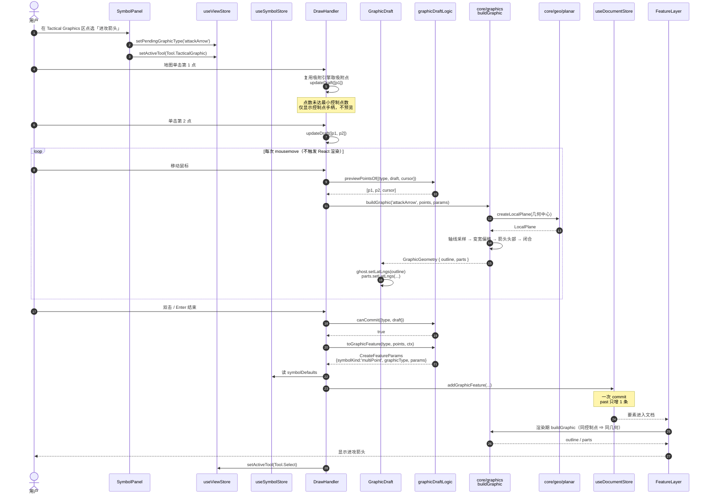
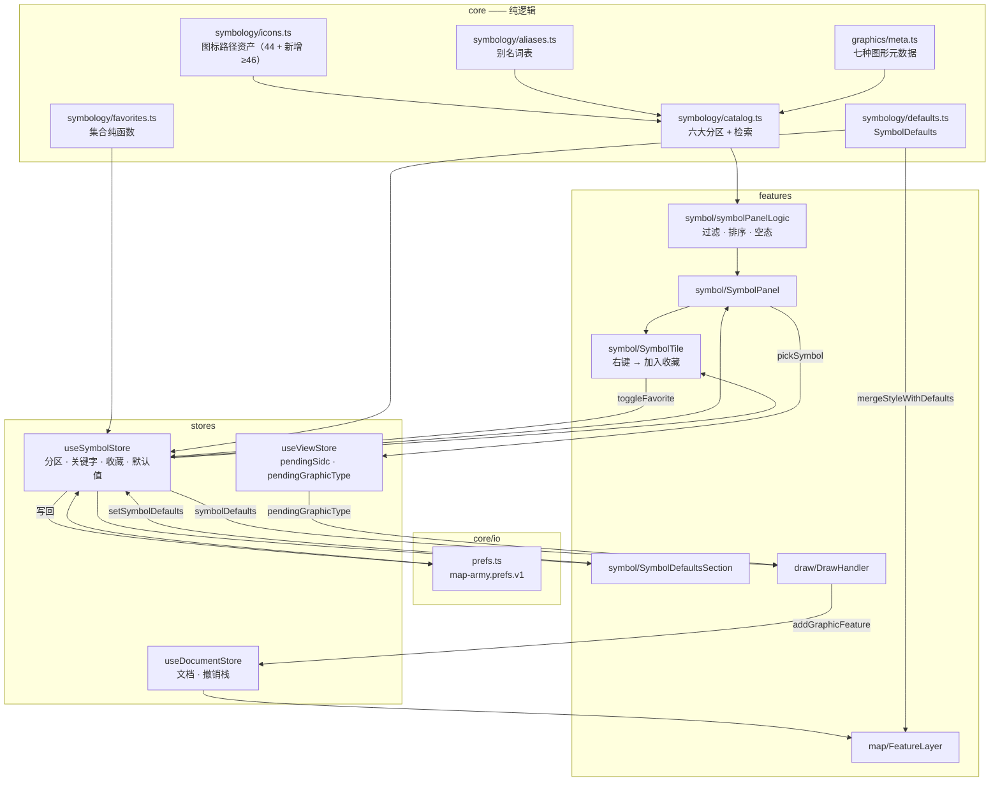
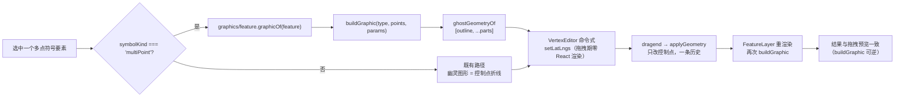

# 架构设计与任务分解：战术图形与符号库结构

> 文档类型：架构设计说明书（Architecture & Task Breakdown）
> 分支：`feature-tactical-graphics`（批次 2）
> 依据：`docs/PRD-roadmap-gap.md` 的 R06 R07 R09 R11 R12 R13 R16 与 §6 十二项拍板结论
> 上游约束：`docs/ARCH-geo-edit.md`（批次 1）——§1.2 数据模型演进与字段预留策略、§1.3 `core/symbology` 与几何生成器的边界、§1.4 `core/io` 序列化层抽象均为**既定契约，本设计不推翻**
> 编写人：高见远（架构师）
> 状态：待评审

---

## 0. 读前须知与基线

### 0.1 设计基线

| 项 | 值 |
| -- | -- |
| 分支 / HEAD | `feature-geo-edit` / `944c296`（docs: 同步路线图与验收清单） |
| 源码规模 | 约 9900 行 + 38 个测试文件 / 673 条测试，全绿 |
| 本批基线前提 | 批次 1 全部 26 项任务已合入并通过 `npm run ci` |

> **开工前强制检查**：`git status` 必须干净。批次 1 曾出现"工作树大量 ` D` 条目导致无法编译"的事故（`ARCH-geo-edit.md` §0.1），本批开工前同样需要先确认工作树完整。本文档不执行任何 git 操作。

### 0.2 已核对的现状（依据 HEAD `944c296` 实读源码）

| 现状 | 结论 |
| ---- | ---- |
| `MapFeature.symbolKind` / `graphicType` | **尚不存在**（批次 1 只写进演进表，未落地）→ 本批 T01 新建 |
| `GeometryKind` | 仅 `point` / `line` / `area` 三种，多点符号所需几何已可承载 |
| `core/graphics` 目录 | 不存在 |
| `core/geo/planar`（局部米制平面） | 不存在；`core/geo` 有 `haversineDistance` / `bearingOf` 等球面计算 |
| 符号定义 | `core/symbology/icons.ts` 四个数组共 **44** 个（`LAND_UNIT` 25 + `AIR` 9 + `SEA_SURFACE` 6 + `SEA_SUBSURFACE` 2） |
| 符号检索 | `listSymbols(symbolSet?)` / `searchSymbols(keyword, symbolSet?)`，只匹配 `name` 与 `nameEn`，无别名、无结果过滤、无分区 |
| `SymbolPanel.tsx` | 四个 `SymbolSet` 分页 tab + 关键字 `useState`（本地状态）+ 身份/梯队下拉；无收藏、无右键菜单 |
| 符号渲染 | `symbolIcon.ts` → `render.ts`（`fontSize = 26` **硬编码**，无字体参数） |
| 要素样式 | `featureStyleOf(feature)`：`override ?? palette/DEFAULT_WEIGHT(3)`，无默认值层 |
| 绘制 | `DrawHandler.tsx` 支持 `Symbol` / `Line` / `Area` / `Measure`；草稿 `useState` + ref 双写；已接入吸附 |
| 顶点编辑 | `VertexEditor.tsx` 用命令式 `ghost.setLatLngs(...)` 渲染幽灵图形（当前直接渲染控制点折线） |
| 剪贴板 | `core/model/clipboard.ts` **自带一份 `cloneFeature` 白名单**（第 68–79 行），与 `factory.ts` 的不是同一个 → 新增字段必须**两处都补** |
| 序列化 | `core/io/milxly.ts` 的 `reviveFeature` 为**白名单重建**，未列字段会被丢弃；`geojson.ts` 只导出 `sidc/name/layer/4 个文本字段/direction` |
| localStorage 键 | 仅 `map-army.session.v1`、`map-army.clipboard.v1`；**`map-army.prefs.v1` 尚未建立** |
| store | `useDocumentStore` / `useViewStore` / `useEditStore` / `useClipboardStore` / `useSessionStore`（无 `useSymbolStore`） |

### 0.3 从批次 1 继承的红线（本批不得违反）

1. `src/core/**` 不得 import `react` / `leaflet` / `features` / `stores`；`core` 只依赖 `core`。
   依赖方向唯一：`features → stores → core`；`core` 内部 `model → geo`、`symbology → model`（**注意：方向是 symbology 依赖 model，反向会成环**）、`graphics → geo/model`、`io → model`。
2. `core/graphics` **不允许**依赖 `core/symbology`（§1.3 划界）。
3. 字段预留四原则（§1.2.1）：**P1 可选字段** / **P2 独立子对象** / **P3 平行数组** / **P4 新增枚举成员配 `assertNever`**。
4. 反面清单：不给 `LonLat` 加字段；不在 `model/types.ts` 之外重复定义同类枚举；不在 `MapFeature` 根层平铺同族字段。
5. 一次用户手势 = 一条撤销记录（手势事务）。
6. **像素 ↔ 经纬度换算只允许走 `features/map/leafletProjection.ts`**，`core` 内禁止出现 `360 / 256 / 2**zoom` 一类魔数。
7. 全部注释简体中文，文件顶部有职责说明，关键函数带 JSDoc。

---

# 第一部分：实现方案与关键决策

## 1.1 D1 · 战术图形的几何如何与 `MapFeature` 共存

### 决策：**不新增 `GeometryKind`；复用 `Line` / `Area` + 两个新的可选字段**

```ts
interface MapFeature {
  // …既有字段…
  /** 符号形态：单点符号 / 多点战术图形。缺省视为 'single' */
  symbolKind?: 'single' | 'multiPoint';
  /** 战术图形种类，仅 symbolKind === 'multiPoint' 时有意义 */
  graphicType?: TacticalGraphicType;
  /** 图形参数（翼展比、箭头头长比、走廊宽度…），缺省用 GRAPHIC_META 的默认值 */
  graphicParams?: GraphicParams;
}
```

| 图形 | `geometry` 用哪种 | `geometry.points` 存什么 |
| ---- | ---------------- | ------------------------ |
| 进攻箭头 `attackArrow` | **area** | 轴线控制点（≥2） |
| 进攻轴线 `axisOfAdvance` | **line** | 轴线控制点（≥2） |
| 防御线 `defenceLine` | **line** | 防线控制点（≥2） |
| 集结地域 `assemblyArea` | **area** | 地域边界控制点（≥3） |
| 分界线 `boundary` | **line** | 分界控制点（≥2） |
| 走廊 `corridor` | **area** | 走廊中心线控制点（≥2） |
| 相位线 `phaseLine` | **line** | 相位线控制点（≥2） |

**理由（四条，按权重排序）**

1. **批次 1 的编辑框架零改动**。`VertexEditor` / `insertVertex` / `deleteVertex` / `moveVertex` / 吸附全部只认 `points: LonLat[]`。多点符号的 `points` 就是**控制点**，编辑器天然可用。若新增 `GeometryKind.TacticalGraphic`，批次 1 的 `minVertexCountOf`、`isValidGeometryUpdate`、`anchorOf`、`boundsOf`、`VertexEditor` 幽灵图形、以及所有 `switch (geometry.kind)` 都要开新分支，等于返工批次 1。
2. **序列化零成本**。`.milxly` / GeoJSON 只需多带两个可选字符串字段（P1 原则），几何本体仍是 `LineString` / `Polygon`，第三方系统打开也不会崩（退化成普通折线/多边形，语义可读）。
3. **`buildGraphic` 可逆**：同控制点 + 同参数 ⇒ 同几何。几何只是"渲染期展开"，不进文档，因此不存在"拖一次变一个样"、也不存在两份数据不一致。
4. **符合 §1.2.2 演进表已写死的方案**（`symbolKind` + `graphicType`，"多点符号不新增 GeometryKind"）。本批只是把它落地。

**被否决的替代方案**

| 方案 | 否决理由 |
| ---- | -------- |
| 新增 `GeometryKind.TacticalGraphic` + `{ controlPoints }` | 违反 §1.2.2 表；批次 1 全部编辑/命中/序列化代码需开分支；`structuredClone` 快照体积翻倍 |
| 把生成后的几何直接写进 `geometry.points` | 控制点与渲染点混淆，顶点编辑会去拖"箭头边缘上的点"，语义崩坏；且无法反向编辑参数 |
| 用 `sidc` 单独编码（不加字段，靠 ControlMeasure 符号集反推） | 图形参数（翼展比）无处存放；且解析 SIDC 才能判定渲染分支，热路径开销大 |

## 1.2 D2 · 几何生成的度量基准：局部米制平面（**本批最关键的技术决策**）

### 问题

箭头翼展、走廊宽度、防御线齿长都是**长度量**。长度必须在某个度量基准上算：像素、还是米？

- **若用像素**（需要注入 `Projection`）：几何随生成时的缩放级别而变，缩放后需重算，且导出/打印（批次 4）时几何与视图耦合 → 不可接受。
- **若用"轴线比例 + 像素长度换算回米"**：数学上等于 `比例 × 轴线地理长度`，推导后与投影无关（缩放 z+1 ⇒ 轴线像素长 ×2、米/像素 ÷2，乘积不变）。既然如此，**像素这一步是多余的**。

### 决策：`core/graphics` 在**局部米制切平面**上计算，不注入 `Projection`，不碰像素

由 `core/geo/planar.ts` 提供：

```ts
/** 以某点为原点的局部平面，x 东为正、y 北为正，单位米 */
export interface LocalPlane {
  readonly origin: LonLat;
  toXY(point: LonLat): Vec2;
  toLonLat(vec: Vec2): LonLat;
}
export function createLocalPlane(origin: LonLat): LocalPlane;
```

采用**等距圆柱近似**（以图形几何中心的纬度固定 `lonMeters = 111320 · cos(lat0)`，`latMeters = 110540`）。

**收益**

| # | 收益 |
| - | ---- |
| 1 | **完全符合 §1.3 的原始契约签名** `buildGraphic(type, controlPoints, params?)`——无需为投影参数修改契约，零推翻 |
| 2 | 纯函数、零依赖注入，**单测只需断言经纬度数值**（断言"箭头头部在末点前方 N 米"这种物理语义，而非像素） |
| 3 | 与缩放级别无关 → 批次 4 导出/打印、批次 5 MilX 交换拿到的几何完全一致 |
| 4 | 不触碰 §0.3 红线 6（像素换算专属 `leafletProjection.ts`）。本换算的输入输出都是**米/度**，属 `core/geo` 范畴，与 `haversineDistance` 同级 |

**精度说明**：等距圆柱近似在 lat0 处最准，偏离 ±3° 时误差 < 0.15%。对战术标图（通常不超过数百公里）足够，与既有球面近似一致。生成器统一**以控制点几何中心为原点**，把误差摊到两侧。

## 1.3 D3 · `core/graphics` 模块边界

| | `core/symbology`（既有） | `core/graphics`（本批新增） |
| - | ------------------------ | --------------------------- |
| 回答的问题 | **画什么**（符号语义与像素绘制） | **长什么样**（几何形状生成） |
| 输入 | SIDC + 文本修饰符 + 尺寸 | 控制点 `LonLat[]` + `GraphicParams` |
| 输出 | SVG 片段 / DivIcon | 纯几何 `GraphicGeometry`（经纬度） |
| 知道 SIDC / 颜色 | 是 | **否** |
| 知道经纬度 | 否 | 是（依赖 `core/geo`） |
| 依赖 | `core/model`（仅类型） | `core/geo` + `core/model`（仅类型） |
| 相互依赖 | **禁止 `graphics → symbology`** | **禁止 `symbology → graphics`** |

**纯函数契约（沿用 §1.3，仅追加可选 `labels`）**

```ts
export interface GraphicGeometry {
  /** 主轮廓：面图形为闭合环，线图形为折线 */
  outline: LonLat[];
  /** 附加笔画，逐条渲染为独立折线（箭头羽线、防御线齿、分界线横杠） */
  parts?: LonLat[][];
  /** 可编辑控制点，缺省等于输入控制点 */
  anchors?: LonLat[];
  /** 文本锚点（相位线两端、走廊入口等），批次 3 文本环绕前只做简易排布 */
  labels?: GraphicLabel[];
}

/** 由控制点与参数生成渲染几何。纯函数、可逆、与控制点严格对应 */
export function buildGraphic(
  type: TacticalGraphicType,
  controlPoints: readonly LonLat[],
  params?: GraphicParams,
): GraphicGeometry;
```

**单测策略**（这是"纯函数如何单测"的答案）

| 断言类别 | 例子 |
| -------- | ---- |
| 幂等 / 可逆 | 同输入调用两次，结果深度相等 |
| 不可变 | 入参数组与元素对象均未被修改（`toHaveBeenCalled` 式深比较快照） |
| 控制点保真 | `outline` 必含首尾控制点；`anchors` 与控制点逐点相等 |
| 几何不变量 | 箭头头部顶点到末点距离 ≈ `headRatio × 轴线长`；走廊两侧偏移距离 ≈ 半宽（用 `haversineDistance` 验证，容差 1%） |
| 退化输入 | 点数不足 → 返回最小可用几何而非抛错；共线点、重复点不产生 NaN |
| 跨纬度 | 同一组控制点整体平移到赤道 / 北纬 60°，生成的几何形状（米制）一致 |

## 1.4 D4 · 七种图形的形状定义

统一流程：`控制点 → 局部平面 XY → 按类型生成 → 转回经纬度`。

| 类型 | 形状算法要点 | 关键参数 |
| ---- | ------------ | -------- |
| `attackArrow` 进攻箭头 | 轴线按 `smooth` 做圆角采样 → 沿轴线两侧按"根部窄、头部宽"的**变宽度**偏移 → 末端生成三角/燕尾箭头头部 → 闭合为面 | `widthRatio`（翼展/轴线长，默认 0.25）、`headRatio`（头长/轴线长，默认 0.22） |
| `axisOfAdvance` 进攻轴线 | 轴线本身 + 末端实心箭头（只描边，不填充） | `headRatio` 默认 0.18 |
| `defenceLine` 防御线 | 轴线 + 在每个采样点沿**法线朝敌侧**画短齿，齿端用小圆点收头（2525D 防御阵地样式） | `toothRatio`（齿长/轴线长，默认 0.18）、`toothSpacingRatio` 默认 0.12 |
| `assemblyArea` 集结地域 | 控制点直接作为闭合多边形（可选圆角）→ 内部按 45° 生成斜线阴影（进 `parts`） | `hatchSpacingRatio` 默认 0.1 |
| `boundary` 分界线 | 轴线 + 在每个采样点法线两侧画等长横杠（跨越轴线的短垂线） | `tickRatio` 默认 0.15、`tickSpacingRatio` 默认 0.1 |
| `corridor` 走廊 | 中心线两侧等距偏移 → 首尾封口为闭合面；入口端加箭头指示 | `corridorWidthMeters`（给了就用绝对值，否则 `widthRatio × 轴线长`） |
| `phaseLine` 相位线 | 轴线 + 两端法线方向的"翼展延长线"（超出端点各 50%）+ 端点标签锚点 | `phaseWingRatio` 默认 0.5 |

> **参数命名统一带 `Ratio` 后缀**表示"相对轴线总长度的比例"，带 `Meters` 后缀表示绝对值。这样生成器永远不需要知道比例尺。

## 1.5 D5 · 符号元数据（分区 / 别名 / 收藏）如何组织与持久化

### 1.5.1 三层分离

```
core/symbology/icons.ts     —— 只管「图标长什么样」（SVG path），不关心分类
core/symbology/catalog.ts   —— 目录：key → 分区、中英文名、符号集、实体码、graphicType
core/symbology/aliases.ts   —— 别名：key → string[]（装备型号、缩写、俗名）
core/symbology/favorites.ts —— 收藏集合的纯函数（不持有状态）
```

**为何不把 `category` / `aliases` 塞进 `SymbolDefinition`**：`icons.ts` 的 `SymbolDefinition` 是**渲染资产**，被 `findSymbol` 的回退链消费；分类与检索是**目录资产**。两者变更频率与责任人不同，混在一起会让"补 20 个装备图标"和"调整分区"互相干扰。

### 1.5.2 目录键

`key = ${symbolSet}-${entity}`（与 `icons.ts` 的检索主键同构），战术图形为 `graphic:${graphicType}`。收藏只存 key。

### 1.5.3 六大分区 ↔ 符号集映射

| 分区 | `SymbolCategory` | 主要符号集 | 本批内容 |
| ---- | ---------------- | ---------- | -------- |
| My Favorites | `favorites` | — | **动态计算**：收藏键与目录求交，空态给引导文案 |
| Formations | `formations` | `LandUnit(10)` `Air(1)` `SeaSurface(30)` `SeaSubsurface(35)` `Dismounted(27)` `LandCivilian(11)` | 现有 44 个重分类 + 补 6 个 |
| Equipment and Installations | `equipment` | `LandEquipment(15)` `LandInstallation(20)` `AirMissile(2)` `Space(5)` `MineWarfare(36)` | **新增约 20 个** |
| Tactical Graphics | `tacticalGraphics` | `ControlMeasure(25)` | 7 个多点图形 + 约 10 个点状控制措施 |
| Function-Specific | `functionSpecific` | `Activities(40)` + 显式覆盖 | **新增约 8 个**（紧急、维和、医疗后送、民事行动…） |
| Metoc | `metoc` | `Atmospheric(45)` `Oceanographic(46)` | **本期空区**（R10 属批次 3），分区存在并显示"后续批次开放"占位 |

分区判定规则：目录条目显式声明 `category`；缺失时由 `DEFAULT_CATEGORY_BY_SYMBOL_SET` 表按符号集兜底。规则集中在一张表，可单测（`meta.test.ts` 断言"每个符号集都有默认分区"）。

### 1.5.4 别名与检索（R07）

```ts
/** 归一化：去空格/连字符/斜杠/点，转小写 */
export function normalizeQuery(keyword: string): string;
/** 归一化后做包含匹配；另支持 SIDC 数字前缀与实体码匹配 */
export function matchesQuery(entry: CatalogEntry, query: string): boolean;
export function searchCatalog(keyword: string, category?: SymbolCategory | 'all'): CatalogEntry[];
```

`"F/A 18"` → `fa18`；别名表给 `F/A-18 Super Hornet` 的 `aliases: ['F/A 18', 'F/A-18', 'FA18', 'F18', 'Hornet', '大黄蜂']` → 归一化后均含 `fa18` ✓。
检索顺序：`name`（中文，不归一化空格）→ `nameEn` → `aliases` → `entity` / SIDC 数字前缀。

**结果过滤**：面板始终显示"当前分区 + 关键字"的交集；关键字非空时标题显示 `搜索结果（N）`，且**跨分区**（由面板提供"在全部分区中搜索"开关，默认开）。

### 1.5.5 收藏的持久化（R13）—— **不进 `MapDocument`**

| 项 | 落点 |
| -- | ---- |
| 收藏键集合 | localStorage `map-army.favorites.v1`，只存 `string[]`（目录 key） |
| 读写实现 | `core/io/prefs.ts`（复用 `persistence.ts` 的 `StorageLike` 注入模式，可单测） |
| 状态容器 | `useSymbolStore.favoriteKeys` |
| 语义 | 收藏的是**符号库条目**，不是要素（§1.2.2 已明确：落到要素上会导致"同一符号的两个要素收藏状态不一致"的语义错误） |

`normalizeFavorites(keys, validKeys)` 在读取时剔除已下线的 key，保证符号库缩容后不残留幽灵项。

## 1.6 D6 · 六大分区与搜索/收藏的 UI 状态归属

### 决策：**新增 `src/stores/useSymbolStore.ts`**

| 状态 | 归属 | 理由 |
| ---- | ---- | ---- |
| `activeCategory`（当前分区） | `useSymbolStore` | 需在面板、工具栏、右键菜单间共享 |
| `keyword`（搜索词） | `useSymbolStore` | 同上；且希望切换分区后保留搜索词 |
| `favoriteKeys` | `useSymbolStore` | 需持久化 + 跨组件共享 |
| `symbolDefaults`（R16） | `useSymbolStore` | 需持久化 + 被 `DrawHandler`（新建要素时套用）与检查器共享 |
| `pendingSidc` | **`useViewStore`（不动）** | 批次 1 的 `DrawHandler` / `SymbolPanel` 已深度依赖，**本批不迁移**，避免动批次 1 代码 |
| `pendingGraphicType` | `useViewStore` | 与 `pendingSidc` 平行，绘制处理器同处消费 |

> ⚠ 这是对 §1.2.5「批次 2 新增 store = —」的**一处细化（+1 store）**，理由：收藏与默认值是"可持久化的用户偏好"，既非文档数据（`useDocumentStore`）也非视图状态（`useViewStore`），塞进 `useViewStore` 会让其职责从"怎么看"扩展到"用户存了什么"。
> **备选方案（若主理人否决）**：把 `activeCategory`/`keyword`/`favoriteKeys`/`symbolDefaults` 收敛为 `useViewStore.symbolLibrary` 一个嵌套子对象，不新增文件。代价是 `useViewStore` 从 13 个字段涨到 14 个字段 + 一个子对象，且偏好与视图共用同一持久化时机。
> → 见 §7 决策点 2。

## 1.7 D7 · R16 符号格式默认值

### 类型与落点

```ts
// core/symbology/defaults.ts —— 纯数据层，不依赖 model（避免 symbology → model 反向依赖）
export interface SymbolDefaults {
  /** 线宽，1 ~ 8，默认 3 */
  weight: number;
  /** 填充色（十六进制），默认 '#0B82D6' */
  fillColor: string;
  /** 填充不透明度 0 ~ 1，默认 0.2 */
  fillOpacity: number;
  /** 修饰符字号，默认 26 */
  fontSize: number;
  /** 修饰符字体，默认 'system-ui, "Segoe UI", sans-serif' */
  fontFamily: string;
}
```

- 落点：`useSymbolStore.symbolDefaults` + localStorage `map-army.prefs.v1`（与收藏同键不同子字段）。
- 规范化：`normalizeSymbolDefaults` 负责夹取越界值、拒绝非有限数、识别非法色值（回退默认），**可单测**。

### 覆盖优先级（三级）

```
要素级 feature.style  >  用户默认值 symbolDefaults  >  SIDC 推导（身份色/状态虚线）
```

- 渲染层：`featureStyleOf(feature, defaults?)` —— `defaults` 为**新增可选参数**，缺省行为与现在完全一致（既有 `featureStyle.test.ts` 不受影响）。
- 新建要素：`core/model/style.ts` 的 `styleFromDefaults(defaults)` 生成 `FeatureStyle`，由 `DrawHandler` 在 `createFeature` 时传入（**core 不读 store**：`createFeature` 仍只接受显式参数，保持可单测）。
- 字号 / 字体：`core/symbology/render.ts` 的 `RenderOptions` 新增可选 `fontSize?` / `fontFamily?`（缺省 26 与系统字体），由 `symbolIcon.ts` 从 `useSymbolStore` 读取后传入。既有 `symbolToSvg` 调用方不受影响。

## 1.8 D8 · 绘制交互：新增 `Tool.TacticalGraphic`

### 决策：复用 `DrawHandler` 草稿状态机，新增一个工具，不新增组件

| 项 | 方案 |
| -- | ---- |
| 工具枚举 | `Tool.TacticalGraphic = 'tacticalGraphic'`（P4 原则，既有 `switch` 补 `assertNever`） |
| 待绘制图形 | `useViewStore.pendingGraphicType: TacticalGraphicType \| null` |
| 采点 | 与 `Line` / `Area` 完全一致：单击采点（复用吸附）、双击 / `Enter` 结束、`Esc` 放弃 |
| 预览 | 新增 `GraphicDraft.tsx`：采点数 ≥ `minControlPointsOf(type)` 时，把「草稿点 + 当前鼠标位置」喂给 `buildGraphic`，渲染生成后的轮廓（面用 `Polygon`，线用 `Polyline` + `parts` 折线） |
| 提交 | `graphicDraftLogic.toGraphicFeature(draft, type, ctx)` 产出 `createFeature` 参数（含 `symbolKind`、`graphicType`、默认 `graphicParams`、默认样式），一次 `addFeature` = 一条历史 |

**为何不复用 `Line` / `Area` 工具 + 事后"转换成箭头"**：那需要额外一步显式操作，且转换前用户看不到箭头形状，演示价值（PRD §4.3"拖出进攻箭头，连续采点成形"）直接丢失。

**性能**：预览几何在 `mousemove` 中重建，O(n)（n ≤ 数十点）。沿用批次 1 的手法——**命令式 `setLatLngs`，不进 React state**，仅在草稿点数量变化时触发一次 React 渲染。

## 1.9 D9 · 渲染与命中测试

### 渲染

```
FeatureLayer
  └─ FeatureShape(feature)
       ├─ feature.graphicType == null → 既有分支（Point / Line / Area）
       └─ feature.graphicType != null → graphicRenderLogic.graphicLayersOf(feature)
              └─ buildGraphic(type, points, params) → { outline, parts, labels }
                    ├─ geometryKindOf(type) === 'area' → <Polygon outline> + parts 折线
                    └─ 'line'                         → <Polyline outline> + parts 折线
```

- 需要 `useMap()` 吗？**不需要**——`buildGraphic` 不依赖投影（D2）。这是 D2 决策的又一收益。
- 样式仍由 `featureStyleOf(feature, defaults)` 决定，`graphics` 不产出任何颜色/线型。
- `labels` 本期只渲染 `name`（复用既有 `<Tooltip>` + 端点小圆点），完整的文本环绕留批次 3（R17）。

### 命中 / 框选（增强项，非阻断）

多点符号的真实包围盒大于控制点包围盒（箭头翼展在外）。处理：

- `core/graphics/feature.ts` 新增 `graphicFeatureBounds(feature): Bounds | null`（多点符号用 `outline`，其余返回 `null` 表示"用默认逻辑"）。
- `core/model/selection.ts` 新增 `featuresInBoundsWith(features, bounds, mode, overrideBoundsOf?)`，**既有 `featuresInBounds` 内部转调它**（签名不变，既有测试不受影响）。
- `useDocumentStore.selectInBounds` 传入 `graphicFeatureBounds` 作为覆盖函数（store 依赖 `core/graphics` 合法）。

## 1.10 D10 · 与批次 1 的兼容处理（顶点编辑 / 吸附 / 复制粘贴 / 序列化）

| 批次 1 能力 | 兼容做法 | 改动量 |
| ----------- | -------- | ------ |
| `VertexEditor` 幽灵图形 | `vertexEditorLogic` 新增 `ghostGeometryOf(feature)`：多点符号返回 `buildGraphic` 的 `outline` + `parts`，其余返回原控制点。命令式 `setLatLngs` 时把 `parts` 的若干条折线一起更新 | 中（改 2 个文件） |
| 控制点手柄 | **零改动**：手柄仍显示控制点，符合"编辑的是控制点"的直觉 | 0 |
| 吸附 | **零改动**：候选集来自 `geometry.points`（控制点） | 0 |
| 顶点方向 `vertexBearings` | 本期**不参与**图形生成（箭头朝向由控制点几何决定）。`resetVertexBearing` 对多点符号无副作用，保留即可 | 0 |
| 复制粘贴 | `factory.cloneFeature` **与** `clipboard.ts` 的内部 `cloneFeature` **两处**白名单都要补 `symbolKind` / `graphicType` / `graphicParams` | 小（2 处，必须做，否则粘贴后箭头变折线） |
| 序列化 | `milxly.reviveFeature` 白名单补三字段；`geojson.ts` 的 `properties` 补 `graphicType`（可选）+ `graphicParams` | 小（2 处） |
| 多选 | **零改动**：`selectedIds` 与几何种类无关 | 0 |
| `boundsOf` / `anchorOf` | 默认走 `points`（控制点），语义正确 | 0 |

## 1.11 D11 · 战术图形的 SIDC 策略

- 符号集统一用 **`ControlMeasure(25)`**。
- 实体代码段：2525D 控制措施实体表条目繁多，本批采用**符号集 25 + 本库内部实体段**（`gx01`…`gx07`）并在 `core/graphics/meta.ts` 内集中登记，`sidcOfGraphic(type, affiliation)` 生成 20 位串。
- **已知代价**：与外军标系统交换时需要一张"内部段 ↔ 2525D 标准实体码"映射表 → **留到批次 5（R54 MilX 原生互转）统一处理**，映射表放在 `core/graphics/standards.ts`（本期不建）。
- 验收要求：`meta.test.ts` 断言每个图形产出的 SIDC 能被 `parseSidc` 正确解析且 `symbolSet === 25`。

## 1.12 D12 · 符号库扩容（配合验收"总数 ≥ 90"）

现状 44，需新增 ≥ 46：

| 分区 | 新增数 | 说明 |
| ---- | ------ | ---- |
| Equipment and Installations | ~20 | 坦克/自行火炮/牵引火炮/火箭炮/雷达/通信车/桥梁/渡场/机场/港口/弹药库/油料库/医院/指挥所… |
| Tactical Graphics | ~17 | 7 个多点 + 10 个点状控制措施（目标、检查点、集结点、突破口…） |
| Function-Specific | ~8 | 紧急、维和、民事行动、医疗后送、人道救援、爆炸物处理… |
| Formations | ~6 | 陆航、空降、两栖、网络空间、太空、特种作战 |

- 图标资产优先**组合已有 path**（如"设施 = 方框 + 已有图标"）以控制工作量；确实需要新图形的再写新 path。
- 单测断言：`listCatalog().length >= 90` 且每个条目 `findSymbol(symbolSet, entity)` 能命中非回退定义（或显式登记的例外）。

---

# 第二部分：文件清单

## 2.1 新增文件（26 个）

### `src/core/graphics/` —— 战术图形几何生成器（纯函数 + 单测，16 个）

| # | 文件 | 职责 |
| - | ---- | ---- |
| 1 | `src/core/graphics/types.ts` | `GraphicGeometry` / `GraphicLabel` 等几何输出类型（类型定义在 model，`buildGraphic` 契约在此） |
| 2 | `src/core/graphics/meta.ts` | 七种图形的元数据表：中文名、最小控制点数、几何种类、默认参数、默认 SIDC 实体段 |
| 3 | `src/core/graphics/meta.test.ts` | 元数据完整性、SIDC 可解析性、每种图形都有默认参数 |
| 4 | `src/core/graphics/vec.ts` | 二维向量与多边形基元：法线、等距偏移、圆角采样、变宽度偏移、斜线阴影生成 |
| 5 | `src/core/graphics/vec.test.ts` | 向量运算正确性、退化输入（零长线段、共线点） |
| 6 | `src/core/graphics/arrow.ts` | 进攻箭头与进攻轴线生成器 |
| 7 | `src/core/graphics/arrow.test.ts` | 头部位置/翼展/闭合性/幂等/不可变 |
| 8 | `src/core/graphics/lineGraphics.ts` | 分界线、相位线、防御线生成器 |
| 9 | `src/core/graphics/lineGraphics.test.ts` | 齿向、横杠间距、端点翼展、单点/共线退化 |
| 10 | `src/core/graphics/areaGraphics.ts` | 集结地域与走廊生成器 |
| 11 | `src/core/graphics/areaGraphics.test.ts` | 偏移距离、闭合性、阴影线数量、宽度参数优先级 |
| 12 | `src/core/graphics/build.ts` | `buildGraphic` 分发、参数合并、点数不足时的降级与校验 |
| 13 | `src/core/graphics/build.test.ts` | 七种类型分发、参数合并优先级、非法类型降级 |
| 14 | `src/core/graphics/feature.ts` | `graphicOf(feature)` / `isTacticalGraphic` / `graphicFeatureBounds`（连接 model 与 graphics） |
| 15 | `src/core/graphics/feature.test.ts` | 要素判定、包围盒扩展、非图形要素返回 null |
| 16 | `src/core/graphics/index.ts` | barrel 出口 |

> 上表 16 项中含 6 个测试文件，源码 10 个。

### `src/core/geo/`（2 个）

| # | 文件 | 职责 |
| - | ---- | ---- |
| 17 | `src/core/geo/planar.ts` | 局部米制切平面：`createLocalPlane` 与经纬/米换算 |
| 18 | `src/core/geo/planar.test.ts` | 往返一致性、跨纬度精度、原点平移不变性 |

### `src/core/symbology/`（6 个）

| # | 文件 | 职责 |
| - | ---- | ---- |
| 19 | `src/core/symbology/catalog.ts` | 符号目录：六大分区、条目表、检索与分区过滤 |
| 20 | `src/core/symbology/catalog.test.ts` | 分区映射、检索命中（含别名）、总数 ≥ 90、排序稳定 |
| 21 | `src/core/symbology/aliases.ts` | 别名词表（装备型号 / 缩写 / 俗名） |
| 22 | `src/core/symbology/favorites.ts` | 收藏集合纯函数：解析、序列化、切换、按目录剔除失效项 |
| 23 | `src/core/symbology/favorites.test.ts` | 切换、去重、失效剔除、非法 JSON 容错 |
| 24 | `src/core/symbology/defaults.ts` | `SymbolDefaults` 类型、默认值常量、规范化与夹取 |

### `src/core/io/` `src/core/model/`（4 个）

| # | 文件 | 职责 |
| - | ---- | ---- |
| 25 | `src/core/io/prefs.ts` | 偏好持久化：收藏键与符号默认值（含 Extended 模式开关骨架），`StorageLike` 注入 |
| 26 | `src/core/io/prefs.test.ts` | 读写往返、脏数据容错、模式骨架字段缺省 |
| 27 | `src/core/model/style.ts` | 符号默认值 → `FeatureStyle` 的映射与合并 |
| 28 | `src/core/model/style.test.ts` | 默认值生成、要素级覆盖、越界夹取 |

### `src/stores/`（1 个）

| # | 文件 | 职责 |
| - | ---- | ---- |
| 29 | `src/stores/useSymbolStore.ts` | 符号库浏览态（分区/关键字）、收藏键、符号默认值；启动时从 `prefs` 载入、变更时回写 |

### `src/features/`（8 个）

| # | 文件 | 职责 |
| - | ---- | ---- |
| 30 | `src/features/symbol/symbolPanelLogic.ts` | 面板纯逻辑：分区过滤 + 关键字检索 + 收藏排序 + 空态判定 |
| 31 | `src/features/symbol/symbolPanelLogic.test.ts` | 过滤、搜索、收藏置顶、空结果 |
| 32 | `src/features/symbol/SymbolTile.tsx` | 单个符号格（预览 + 名称 + 右键菜单「加入/移出收藏」） |
| 33 | `src/features/symbol/SymbolDefaultsSection.tsx` | R16 默认值表单（线宽 / 填充色 / 字号 / 字体） |
| 34 | `src/features/draw/graphicDraftLogic.ts` | 采点合法性（最小点数）、预览几何构造、提交参数构造 |
| 35 | `src/features/draw/graphicDraftLogic.test.ts` | 点数不足拒绝提交、提交参数字段完整、预览几何来源正确 |
| 36 | `src/features/draw/GraphicDraft.tsx` | 绘制期的多点符号预览层（命令式刷新，不进 React state） |
| 37 | `src/features/map/graphicRenderLogic.ts` | 由要素生成 Leaflet 图层描述（轮廓 + 附加笔画）的纯逻辑 |
| 38 | `src/features/map/graphicRenderLogic.test.ts` | 面/线分支、parts 拆分、非图形要素返回 null |

## 2.2 修改文件（17 个）

| # | 文件 | 改动要点 |
| - | ---- | -------- |
| 1 | `src/core/model/types.ts` | 新增 `TacticalGraphicType` 常量与类型、`GraphicParams`、`SymbolKind`；`MapFeature.{symbolKind,graphicType,graphicParams}`；`Tool.TacticalGraphic` |
| 2 | `src/core/model/index.ts` | 导出新增类型与 `style.ts` |
| 3 | `src/core/model/factory.ts` | `createFeature` 支持 `symbolKind` / `graphicType` / `graphicParams`；`cloneFeature` 复制三字段 |
| 4 | `src/core/model/clipboard.ts` | **内部 `cloneFeature` 白名单补三字段**（易漏点） |
| 5 | `src/core/model/selection.ts` | 新增 `featuresInBoundsWith(..., overrideBoundsOf?)`；`featuresInBounds` 转调它 |
| 6 | `src/core/geo/index.ts` | 导出 `planar` |
| 7 | `src/core/symbology/icons.ts` | 新增装备/设施/职能/控制措施符号定义（≥ 46 个） |
| 8 | `src/core/symbology/render.ts` | `RenderOptions` 新增可选 `fontSize?` / `fontFamily?`；`fontSize` 不再硬编码 |
| 9 | `src/core/symbology/index.ts` | 导出 `catalog` / `favorites` / `defaults` / `SymbolCategory` |
| 10 | `src/core/io/milxly.ts` | `reviveFeature` 白名单补 `symbolKind` / `graphicType` / `graphicParams` |
| 11 | `src/core/io/geojson.ts` | `properties` 补 `graphicType` / `graphicParams`（可选，导入时宽容解析） |
| 12 | `src/core/io/index.ts` | 导出 `prefs` |
| 13 | `src/stores/useViewStore.ts` | 新增 `pendingGraphicType` 与 `setPendingGraphicType` |
| 14 | `src/stores/useDocumentStore.ts` | `selectInBounds` 传入 `graphicFeatureBounds`；新增 `addGraphicFeature`（可选，见 T25） |
| 15 | `src/features/symbol/SymbolPanel.tsx` | 六大分区 UI、搜索过滤、收藏入口、默认值区块挂载 |
| 16 | `src/features/draw/DrawHandler.tsx` | 接入 `Tool.TacticalGraphic`：采点、预览、提交、吸附复用 |
| 17 | `src/features/draw/vertexEditorLogic.ts` + `VertexEditor.tsx` | 幽灵图形改由 `ghostGeometryOf` 提供（多点符号渲染生成几何） |
| 18 | `src/features/map/FeatureLayer.tsx` | `FeatureShape` 增加多点符号渲染分支（调用 `graphicRenderLogic`） |
| 19 | `src/features/inspector/Inspector.tsx` | 多点符号只读展示图形类型 + 参数微调（翼展/宽度）+ 默认值入口 |
| 20 | `src/App.tsx` | 挂载 `useSymbolStore` 的偏好载入（或由 store 自举） |
| 21 | `src/styles/global.css` | 分区 tab、搜索结果、收藏标记、右键菜单、默认值表单、图形预览样式 |
| 22 | `src/features/toolbar/Toolbar.tsx` | （视情况）战术图形工具入口或分区快捷切换 |

**规模合计**：新增 **38 个文件**（其中源码 23 个、单测 15 个），修改 **22 个文件**。**零删除、零重命名、零依赖新增**。

---

# 第三部分：数据结构与接口

## 3.1 模型增量（`src/core/model/types.ts`）

```ts
/** 符号形态：单点符号 / 多点战术图形（R09） */
export const SymbolKind = {
  /** 单点符号：普通单位、装备、设施 */
  Single: 'single',
  /** 多点战术图形：由控制点生成渲染几何 */
  MultiPoint: 'multiPoint',
} as const;
export type SymbolKind = (typeof SymbolKind)[keyof typeof SymbolKind];

/**
 * 战术图形种类（R09）。
 *
 * 之所以定义在 model 而非 graphics：graphics 需要 import 它，
 * 而 model 不允许依赖 graphics（会造成循环依赖）；
 * 且 §1.2.1 明令「不得在 model/types.ts 之外重复定义同类枚举」。
 */
export const TacticalGraphicType = {
  /** 进攻箭头（面） */
  AttackArrow: 'attackArrow',
  /** 进攻轴线（线 + 末端箭头） */
  AxisOfAdvance: 'axisOfAdvance',
  /** 防御线（线 + 齿） */
  DefenceLine: 'defenceLine',
  /** 集结地域（面 + 斜线阴影） */
  AssemblyArea: 'assemblyArea',
  /** 分界线（线 + 横杠） */
  Boundary: 'boundary',
  /** 走廊（面，中心线等距偏移） */
  Corridor: 'corridor',
  /** 相位线（线 + 两端翼展） */
  PhaseLine: 'phaseLine',
} as const;
export type TacticalGraphicType = (typeof TacticalGraphicType)[keyof typeof TacticalGraphicType];

/**
 * 战术图形参数。
 *
 * 命名约定：`*Ratio` 表示「相对轴线总长度的比例」（与比例尺、缩放无关），
 * `*Meters` 表示绝对值。生成器永远不需要知道屏幕比例尺。
 * 全部字段可选，缺省时取 `core/graphics/meta` 的默认值。
 */
export interface GraphicParams {
  /** 翼展比例：箭头最宽处 / 轴线长，默认 0.25 */
  widthRatio?: number;
  /** 箭头头部长度比例：头长 / 轴线长，默认 0.22 */
  headRatio?: number;
  /** 走廊宽度（米）。给了就用绝对值，否则用 widthRatio × 轴线长 */
  corridorWidthMeters?: number;
  /** 防御线齿长比例，默认 0.18 */
  toothRatio?: number;
  /** 防御线齿间距比例，默认 0.12 */
  toothSpacingRatio?: number;
  /** 分界线横杠长度比例，默认 0.15 */
  tickRatio?: number;
  /** 分界线横杠间距比例，默认 0.1 */
  tickSpacingRatio?: number;
  /** 相位线端点翼展比例，默认 0.5 */
  phaseWingRatio?: number;
  /** 集结地域斜线阴影间距比例，默认 0.1 */
  hatchSpacingRatio?: number;
  /** 转角是否圆滑采样，默认 true */
  smooth?: boolean;
}

export interface MapFeature {
  // …既有字段全部不变…
  /** 符号形态，缺省视为 'single'（R09） */
  symbolKind?: SymbolKind;
  /** 战术图形种类；仅在 symbolKind === 'multiPoint' 时有意义（R09） */
  graphicType?: TacticalGraphicType;
  /** 图形参数覆盖；缺省用 GRAPHIC_META 的默认值（R09） */
  graphicParams?: GraphicParams;
}

export const Tool = {
  // …既有成员…
  /** 绘制多点战术图形（R09） */
  TacticalGraphic: 'tacticalGraphic',
} as const;
```

## 3.2 局部米制平面（`src/core/geo/planar.ts`）

```ts
/** 平面坐标，x 东为正、y 北为正，单位米 */
export interface Vec2 {
  x: number;
  y: number;
}

/** 以某点为原点的局部切平面 */
export interface LocalPlane {
  /** 平面原点 */
  readonly origin: LonLat;
  /** 经纬度 → 平面米坐标 */
  toXY(point: LonLat): Vec2;
  /** 平面米坐标 → 经纬度 */
  toLonLat(vec: Vec2): LonLat;
}

/** 某一纬度上 1 度对应的米数（等距圆柱近似） */
export function metersPerDegreeAt(lat: number): { lonMeters: number; latMeters: number };

/**
 * 建立以 origin 为中心的局部米制平面。
 *
 * 采用等距圆柱近似：经度米数按原点纬度固定，纬度米数取常数。
 * 在原点附近最准确，偏离 ±3° 时误差 < 0.15%，
 * 与既有 haversineDistance 的球面近似属同一精度级别。
 */
export function createLocalPlane(origin: LonLat): LocalPlane;
```

## 3.3 几何生成器（`src/core/graphics/`）

```ts
// ── types.ts ────────────────────────────────────────────────
export interface GraphicLabel {
  /** 标签锚点 */
  at: LonLat;
  /** 建议排布方位（度，真北顺时针），供 UI 放置文本 */
  bearing: number;
  /** 标签语义，供 UI 决定默认文案 */
  role: 'name' | 'start' | 'end' | 'axis';
}

export interface GraphicGeometry {
  /** 主轮廓：面图形为闭合环，线图形为折线 */
  outline: LonLat[];
  /** 附加笔画，逐条渲染为独立折线 */
  parts?: LonLat[][];
  /** 可编辑控制点，缺省等于输入控制点 */
  anchors?: LonLat[];
  /** 文本锚点 */
  labels?: GraphicLabel[];
}

// ── meta.ts ─────────────────────────────────────────────────
export interface GraphicMeta {
  type: TacticalGraphicType;
  /** 中文名 */
  name: string;
  /** 英文名 */
  nameEn: string;
  /** 最小控制点数 */
  minControlPoints: number;
  /** 落到要素上时使用的几何种类 */
  geometryKind: 'line' | 'area';
  /** 默认参数（与用户参数做浅合并） */
  defaultParams: Required<GraphicParams>;
  /** 本库内部实体代码段，用于拼装 SIDC */
  entity: string;
}

export function metaOf(type: TacticalGraphicType): GraphicMeta;
export function minControlPointsOf(type: TacticalGraphicType): number;
export function geometryKindOf(type: TacticalGraphicType): 'line' | 'area';
export function resolveGraphicParams(type: TacticalGraphicType, params?: GraphicParams): Required<GraphicParams>;
export function sidcOfGraphic(type: TacticalGraphicType, affiliation: Affiliation): string;

// ── build.ts ────────────────────────────────────────────────
/**
 * 由控制点与参数生成渲染几何。
 *
 * 纯函数、可逆（同输入必得同输出）、不修改入参。
 * 不依赖任何投影或屏幕信息：一切长度在局部米制平面上按轴线比例计算，
 * 因此结果与缩放级别无关，导出与交换时完全一致。
 */
export function buildGraphic(
  type: TacticalGraphicType,
  controlPoints: readonly LonLat[],
  params?: GraphicParams,
): GraphicGeometry;

// ── feature.ts ──────────────────────────────────────────────
export function isTacticalGraphic(feature: MapFeature): boolean;
/** 生成要素的渲染几何；非多点符号返回 null */
export function graphicOf(feature: MapFeature): GraphicGeometry | null;
/** 多点符号返回包含 outline 的包围盒；其余返回 null（表示沿用默认逻辑） */
export function graphicFeatureBounds(feature: MapFeature): Bounds | null;
```

## 3.4 符号目录 / 别名 / 收藏（`src/core/symbology/`）

```ts
// ── catalog.ts ──────────────────────────────────────────────
export const SymbolCategory = {
  Favorites: 'favorites',
  Formations: 'formations',
  Equipment: 'equipment',
  TacticalGraphics: 'tacticalGraphics',
  FunctionSpecific: 'functionSpecific',
  Metoc: 'metoc',
} as const;
export type SymbolCategory = (typeof SymbolCategory)[keyof typeof SymbolCategory];

/** 分区显示顺序（面板 tab 顺序） */
export const SYMBOL_CATEGORY_ORDER: readonly SymbolCategory[];
export function categoryLabelOf(category: SymbolCategory): string;

export interface CatalogEntry {
  /** 稳定键：`${symbolSet}-${entity}`，战术图形为 `graphic:${type}` */
  key: string;
  name: string;
  nameEn: string;
  category: SymbolCategory;
  symbolSet: SymbolSet;
  /** 6 位实体代码；战术图形为本库内部段 */
  entity: string;
  /** 战术图形类型，仅 tacticalGraphics 分区有值 */
  graphicType?: TacticalGraphicType;
}

export function listCatalog(): readonly CatalogEntry[];
export function findCatalogEntry(key: string): CatalogEntry | undefined;
export function entriesInCategory(category: SymbolCategory): CatalogEntry[];
/** 关键字检索；category 省略或 'all' 时跨分区 */
export function searchCatalog(keyword: string, category?: SymbolCategory | 'all'): CatalogEntry[];
/** 归一化：去空格 / 连字符 / 斜杠 / 点，转小写 */
export function normalizeQuery(keyword: string): string;
export function matchesQuery(entry: CatalogEntry, query: string): boolean;
/** 按身份与梯队生成该条目的 20 位 SIDC */
export function sidcOfEntry(entry: CatalogEntry, affiliation: Affiliation, amplifier?: number): string;

// ── favorites.ts ────────────────────────────────────────────
export const FAVORITES_VERSION = 1;
/** 剔除失效键、去重、保序 */
export function normalizeFavorites(keys: readonly string[], valid: ReadonlySet<string>): string[];
export function toggleFavorite(keys: readonly string[], key: string): string[];
export function isFavorite(keys: readonly string[], key: string): boolean;
export function parseFavorites(raw: string | null): string[];
export function serializeFavorites(keys: readonly string[]): string;

// ── defaults.ts ─────────────────────────────────────────────
export interface SymbolDefaults {
  weight: number;
  fillColor: string;
  fillOpacity: number;
  fontSize: number;
  fontFamily: string;
}
export const DEFAULT_SYMBOL_DEFAULTS: SymbolDefaults;
/** 夹取越界值、拒绝非有限数、非法色值回退默认 */
export function normalizeSymbolDefaults(value: Partial<SymbolDefaults> | null | undefined): SymbolDefaults;
```

## 3.5 偏好持久化（`src/core/io/prefs.ts`）

```ts
export const PREFS_STORAGE_KEY = 'map-army.prefs.v1';

export interface AppPrefs {
  version: 1;
  /** 收藏的目录键 */
  favorites: string[];
  /** 符号格式默认值（R16） */
  symbolDefaults: SymbolDefaults;
  /**
   * 工作模式骨架（R14，本期只存不生效）。
   * 按拍板结论，Extended 模式开关仅预留，瑞士国家符号不做。
   */
  symbolMode: 'standard' | 'extended';
}

export const DEFAULT_APP_PREFS: AppPrefs;
export function parsePrefs(raw: string | null): AppPrefs;
export function serializePrefs(prefs: AppPrefs): string;
export function loadPrefs(storage?: StorageLike): AppPrefs;
export function savePrefs(prefs: AppPrefs, storage?: StorageLike): void;
```

## 3.6 样式默认值（`src/core/model/style.ts`）

```ts
/** 由符号默认值生成要素样式（新建要素时套用） */
export function styleFromDefaults(defaults: SymbolDefaults): FeatureStyle;
/** 三级覆盖：要素级 style > 默认值 > SIDC 推导（由 features/map/featureStyle.ts 消费） */
export function mergeStyleWithDefaults(
  style: FeatureStyle | undefined,
  defaults: SymbolDefaults,
): FeatureStyle;
```

## 3.7 Store 接口

```ts
// ── src/stores/useSymbolStore.ts ────────────────────────────
export interface SymbolState {
  /** 当前分区 */
  activeCategory: SymbolCategory;
  /** 搜索关键字 */
  keyword: string;
  /** 关键字为空时是否跨全部分区搜索（默认 true） */
  searchAcrossCategories: boolean;
  /** 收藏的目录键 */
  favoriteKeys: string[];
  /** 符号格式默认值（R16） */
  symbolDefaults: SymbolDefaults;
  /** 工作模式骨架（R14，本期只存不生效） */
  symbolMode: 'standard' | 'extended';

  setActiveCategory: (category: SymbolCategory) => void;
  setKeyword: (keyword: string) => void;
  toggleSearchAcrossCategories: () => void;
  toggleFavorite: (key: string) => void;
  setSymbolDefaults: (patch: Partial<SymbolDefaults>) => void;
  resetSymbolDefaults: () => void;
  setSymbolMode: (mode: 'standard' | 'extended') => void;
  /** 启动时从 prefs 载入 */
  hydrate: () => void;
}

// ── src/stores/useViewStore.ts（增量） ──────────────────────
export interface ViewState {
  // …既有…
  /** 待绘制的战术图形类型；null 表示当前不绘制战术图形 */
  pendingGraphicType: TacticalGraphicType | null;
  setPendingGraphicType: (type: TacticalGraphicType | null) => void;
}

// ── src/stores/useDocumentStore.ts（增量） ──────────────────
export interface DocumentState {
  // …既有…
  /** 原子创建一个多点战术图形要素（内部 = createGraphicFeature + addFeature） */
  addGraphicFeature: (params: {
    layerId: string;
    type: TacticalGraphicType;
    points: LonLat[];
    affiliation: Affiliation;
    params?: GraphicParams;
    style?: FeatureStyle;
  }) => void;
}
```

## 3.8 绘制与渲染的纯逻辑

```ts
// ── src/features/draw/graphicDraftLogic.ts ──────────────────
export interface GraphicDraftInput {
  type: TacticalGraphicType;
  /** 已采集的控制点 */
  draft: readonly LonLat[];
  /** 当前鼠标位置（预览时用） */
  cursor: LonLat | null;
}
/** 预览用的控制点序列：草稿 + 光标（仅在点数不足时拼上光标） */
export function previewPointsOf(input: GraphicDraftInput): LonLat[];
/** 是否达到可预览的最少点数 */
export function canPreview(input: GraphicDraftInput): boolean;
/** 是否达到可提交的最少点数 */
export function canCommit(input: GraphicDraftInput): boolean;
/** 构造提交所需的 createFeature 参数（含 symbolKind/graphicType/默认 params） */
export function toGraphicFeature(
  type: TacticalGraphicType,
  points: readonly LonLat[],
  context: { layerId: string; affiliation: Affiliation; style?: FeatureStyle },
): CreateFeatureParams | null;

// ── src/features/map/graphicRenderLogic.ts ──────────────────
export interface GraphicRenderLayer {
  /** 主轮廓是否填充（面图形为 true） */
  filled: boolean;
  /** 主轮廓顶点 */
  outline: [number, number][];
  /** 附加笔画，逐条折线 */
  parts: [number, number][][];
}
/** 由要素生成 Leaflet 图层描述；非多点符号返回 null */
export function graphicLayersOf(feature: MapFeature): GraphicRenderLayer | null;

// ── src/features/draw/vertexEditorLogic.ts（增量） ───────────
/** 幽灵图形的顶点序列集合：多点符号返回 [outline, ...parts]，其余返回 [[points]] */
export function ghostGeometryOf(feature: MapFeature): LonLat[][];
```

---

# 第四部分：流程图

## 4.1 战术图形绘制与几何生成流程



## 4.2 符号库分组 / 搜索 / 收藏数据流



## 4.3 编辑期几何重建（与批次 1 顶点编辑器共存）



---

# 第五部分：有序任务列表

> 排序原则：**`core` 纯函数与其单测必须排在对应 UI 之前**；store 在 core 之后、UI 之前；
> 每个任务一个 commit，全部完成后 `npm run ci` 必须全绿。
> 依赖列中的 `T##` 指本表任务号。

| # | 任务 | 依赖 | 涉及文件 | 验收要点 |
| - | ---- | ---- | -------- | -------- |
| **T01** | 模型字段扩展：`SymbolKind` / `TacticalGraphicType` / `GraphicParams` / `MapFeature.{symbolKind,graphicType,graphicParams}` / `Tool.TacticalGraphic`，全部可选 | — | 改 `core/model/types.ts`、`core/model/index.ts` | `tsc -b` 通过；既有 673 条单测不因必填性失败；`Tool` 新增成员后既有 `switch` 无编译错误 |
| **T02** | `core/geo/planar.ts` 局部米制平面 + 单测 | T01 | 新增 `planar.ts` `planar.test.ts`；改 `core/geo/index.ts` | ≥ 8 条：往返一致（误差 < 1e-9 度）、跨纬度米数、原点平移不变性 |
| **T03** | `core/graphics/vec.ts` 向量与多边形基元 + 单测 | T02 | 新增 `vec.ts` `vec.test.ts` | ≥ 10 条：法线方向、等距偏移、变宽偏移、圆角采样、斜线阴影、零长线段与共线退化不产生 NaN |
| **T04** | `core/graphics/meta.ts` 七种图形元数据 + 单测 | T01 | 新增 `meta.ts` `meta.test.ts` | ≥ 8 条：每种图形都有默认参数与最小点数；`sidcOfGraphic` 产出的 SIDC 可被 `parseSidc` 解析且 `symbolSet === 25` |
| **T05** | `core/graphics/arrow.ts` 进攻箭头 / 进攻轴线 + 单测 | T02 T03 T04 | 新增 `arrow.ts` `arrow.test.ts` | ≥ 10 条：头部顶点到末点距离 ≈ `headRatio × 轴线长`（用 `haversineDistance`，容差 1%）；闭合性；幂等；不修改入参；2 点直线退化可用 |
| **T06** | `core/graphics/lineGraphics.ts` 分界线 / 相位线 / 防御线 + 单测 | T02 T03 T04 | 新增 `lineGraphics.ts` `lineGraphics.test.ts` | ≥ 12 条：齿位于法线朝敌侧、横杠等长且垂直轴线、相位线端点翼展、单点/共线退化 |
| **T07** | `core/graphics/areaGraphics.ts` 集结地域 / 走廊 + 单测 | T02 T03 T04 | 新增 `areaGraphics.ts` `areaGraphics.test.ts` | ≥ 10 条：走廊两侧到中心线距离 ≈ 半宽（容差 1%）；`corridorWidthMeters` 优先于 `widthRatio`；阴影线数量与间距 |
| **T08** | `core/graphics/build.ts` 分发与参数合并 + `index.ts` + 单测 | T04 T05 T06 T07 | 新增 `build.ts` `build.test.ts` `index.ts` | ≥ 8 条：七种类型分发正确、参数合并优先级（用户 > 默认）、点数不足时返回最小可用几何而非抛错、未知类型降级 |
| **T09** | `core/graphics/feature.ts`（`graphicOf` / `isTacticalGraphic` / `graphicFeatureBounds`）+ 单测 | T08 | 新增 `feature.ts` `feature.test.ts` | ≥ 6 条：要素判定、包围盒包含 outline、非图形要素返回 null |
| **T10** | `core/symbology/defaults.ts` 符号默认值类型与规范化 + 单测 | T01 | 新增 `defaults.ts`；单测并入 `catalog.test.ts` 或独立 | ≥ 6 条：越界夹取、非有限数拒绝、非法色值回退、缺省补全 |
| **T11** | `core/model/style.ts` 默认值 ↔ `FeatureStyle` 映射 + 单测 | T10 | 新增 `style.ts` `style.test.ts`；改 `core/model/index.ts` | ≥ 6 条：默认值生成、要素级覆盖、空 style 处理 |
| **T12** | `core/symbology/aliases.ts` + `catalog.ts` 六大分区与检索 + 单测 | T01 T04 | 新增 `aliases.ts` `catalog.ts` `catalog.test.ts` | ≥ 14 条：分区映射全覆盖（每个符号集有默认分区）、`"F/A 18"` 命中、SIDC 前缀命中、空关键字返回全量、排序稳定、总数 ≥ 90 |
| **T13** | `core/symbology/favorites.ts` 收藏集合纯函数 + 单测 | T12 | 新增 `favorites.ts` `favorites.test.ts` | ≥ 8 条：切换、去重保序、失效键剔除（符号库缩容）、非法 JSON 返回空、序列化往返 |
| **T14** | `core/io/prefs.ts` 偏好持久化（收藏 + 默认值 + 模式骨架）+ 单测 | T10 T13 | 新增 `prefs.ts` `prefs.test.ts`；改 `core/io/index.ts` | ≥ 8 条：读写往返、脏数据容错、缺失字段补默认、`symbolMode` 缺省 `'standard'` |
| **T15** | 符号库扩容：`icons.ts` 新增装备/设施/职能/控制措施符号（≥ 46 个，总数 ≥ 90） | T12 | 改 `core/symbology/icons.ts`、`aliases.ts` | 单测断言 `listCatalog().length >= 90`；每个条目 `findSymbol` 命中非回退定义；`npm run lint` 无未用导入 |
| **T16** | `render.ts` 支持 `fontSize` / `fontFamily` | T10 | 改 `core/symbology/render.ts`、`core/symbology/index.ts` | 单测断言：`options.fontSize` 出现在 SVG 的 `font-size`；缺省仍为 26（既有测试不变） |
| **T17** | 字段贯通：`factory.createFeature` / `factory.cloneFeature` / **`clipboard.ts` 内部 `cloneFeature`** / `milxly.reviveFeature` / `geojson` 属性 | T01 T04 | 改 4 个文件 | **往返单测 ≥ 6 条**：要素带 `graphicType` 序列化后反序列化字段不丢；`cloneFeature` 与剪贴板复制后 `graphicType` 保留（**易漏点：clipboard.ts 有独立白名单**） |
| **T18** | `core/model/selection.ts` 新增 `featuresInBoundsWith`；`featuresInBounds` 转调 | T09 | 改 `core/model/selection.ts` | 既有 `selection.test.ts` 全绿；新增 ≥ 3 条覆盖 `overrideBoundsOf` 分支 |
| **T19** | `useSymbolStore` + `useViewStore.pendingGraphicType` | T12 T13 T14 | 新增 `stores/useSymbolStore.ts`（含测试）；改 `useViewStore.ts` | 收藏切换后写入 prefs；默认值修改后持久化；重载后恢复 |
| **T20** | `useDocumentStore.addGraphicFeature` 与 `selectInBounds` 包围盒修正 | T09 T18 T19 | 改 `stores/useDocumentStore.ts`（含测试） | 单测：创建多点符号要素 `past` 增 1；框选能命中箭头翼展外的区域 |
| **T21** | `symbolPanelLogic.ts`（过滤 / 检索 / 收藏排序 / 空态）+ 单测 | T12 T13 | 新增 `symbolPanelLogic.ts` `symbolPanelLogic.test.ts` | ≥ 10 条：分区过滤、跨分区搜索开关、收藏置顶、空结果判定、Metoc 空区引导文案 |
| **T22** | `SymbolPanel.tsx` 六大分区 UI + 搜索过滤 + `SymbolTile` 右键收藏 | T19 T21 T15 | 改 `SymbolPanel.tsx`；新增 `SymbolTile.tsx` | 六个 tab 可切换；搜索实时过滤；右键菜单加入/移出收藏；刷新后收藏保留 |
| **T23** | `SymbolDefaultsSection.tsx`（R16 表单） | T19 T10 | 新增 `SymbolDefaultsSection.tsx`；改 `SymbolPanel.tsx` | 改线宽/填充色/字号/字体后新建要素立即套用；既有要素不受影响（要素级覆盖优先） |
| **T24** | `graphicDraftLogic.ts` + `GraphicDraft.tsx` + `DrawHandler` 接入 `Tool.TacticalGraphic` | T08 T19 | 新增 `graphicDraftLogic.ts`(含测试) `GraphicDraft.tsx`；改 `DrawHandler.tsx` | ≥ 8 条逻辑单测；冒烟：拖出进攻箭头连续采点成形、双击结束、一次 Ctrl+Z 撤回 |
| **T25** | `graphicRenderLogic.ts` + `FeatureLayer` 多点符号渲染分支 | T08 T09 | 新增 `graphicRenderLogic.ts`(含测试)；改 `FeatureLayer.tsx` | ≥ 6 条逻辑单测；冒烟：刷新页面后箭头形状与绘制时一致 |
| **T26** | `VertexEditor` 幽灵图形改用 `ghostGeometryOf`（多点符号渲染生成几何） | T09 T25 | 改 `vertexEditorLogic.ts` `VertexEditor.tsx` | 拖拽多点符号顶点时幽灵图形实时改形；松手后与最终渲染一致；**拖拽期 document 不变**（沿用批次 1 断言） |
| **T27** | `Inspector` 多点符号只读展示 + 参数微调（翼展 / 走廊宽度） | T20 T25 | 改 `Inspector.tsx` | 选中箭头显示类型与参数；改参数后几何立即更新且只有一条历史 |
| **T28** | 样式补齐、README 图例同步、冒烟清单 | 全部 | 改 `styles/global.css`、`README.md`、`docs/ARCH-tactical-graphics.md`；新增 `docs/SMOKE-TEST-tactical-graphics.md` | `npm run ci` 四项全绿；新增单测 ≥ 30 条；符号总数 ≥ 90；6 步冒烟清单可执行 |

**关键路径**：T01 → T02 → T03 → T04 → {T05, T06, T07} → T08 → T09 → T25 → T26。
**可并行**：T10 / T11 / T12 / T13 / T14 与 T02–T09 完全并行；T15 / T16 / T17 与 T19–T23 并行；T27 可在 T25 后独立进行。
**最小可演示集**：T01–T09 + T19 + T24 + T25（箭头可画可看）；T22 / T23 属于符号库结构，可紧随其后。

---

# 第六部分：依赖包

**零新增。**

| 需求 | 常规做法 | 本项目做法 |
| ---- | -------- | ---------- |
| 战术图形几何 | 引入 `mil-sym-js` / `milsymbol`（体积大、带自身渲染体系，与自研 2525 符号引擎冲突） | 自研 `core/graphics` 纯函数 + `core/geo/planar` 局部米制平面 |
| 多边形偏移 / 缓冲区 | `polygon-clipping` / `jsts`（~200 KB） | `core/graphics/vec.ts` 自实现等距偏移与圆角采样（战术图形只需单侧偏移，无需通用布尔运算） |
| 模糊搜索 | `fuse.js` | `normalizeQuery` + 包含匹配（符号量级 ≤ 数百，无需模糊打分） |
| 状态持久化 | `zustand/middleware persist` | `core/io/prefs.ts` + `StorageLike` 注入（与既有 `persistence.ts` 同构，可单测） |
| 右键菜单 | `react-contextmenu` | 原生 `onContextMenu` + 绝对定位 div（零依赖，与面板风格一致） |

> 既有依赖 `jspdf` / `html-to-image` 属批次 4，`leaflet` / `react-leaflet` / `zustand` 均不升级。

---

# 第七部分：共享知识与跨文件约定

| 主题 | 约定 |
| ---- | ---- |
| **几何归属** | 多点符号**不新增 `GeometryKind`**。`geometry.points` 恒为**控制点**；渲染几何由 `buildGraphic` 在渲染/编辑期生成，**不入文档** |
| **长度单位** | `GraphicParams` 中 `*Ratio` = 相对轴线总长的比例（与比例尺/缩放无关）；`*Meters` = 绝对米数。生成器内部一律在**局部米制平面**计算（D2） |
| **像素换算** | 仍**只允许** `features/map/leafletProjection.ts`。`core/geo/planar.ts` 做的是**米 ↔ 度**换算（地理量），不是像素换算，不违反批次 1 §2.8 约定。code review 必查项 |
| **依赖方向** | `graphics → geo + model(仅类型)`；**禁止 `graphics → symbology`**；**禁止 `symbology → model`（会造成 model→symbology→model 成环）**。`TacticalGraphicType` 因此定义在 `core/model/types.ts` |
| **样式责任** | `core/graphics` **绝不产出颜色、线宽、虚线**。全部样式由 `features/map/featureStyle.ts` 经 `featureStyleOf(feature, defaults?)` 决定 |
| **`buildGraphic` 三性** | 纯（不修改入参、不读全局）、可逆（同输入同输出）、与控制点严格对应（首尾控制点必在 `outline` 上） |
| **新增字段的三处同步** | 任何 `MapFeature` 新增字段必须同步检查：① `core/model/factory.ts` 的 `cloneFeature`；② **`core/model/clipboard.ts` 内部的 `cloneFeature`（独立白名单，最易漏）**；③ `core/io/milxly.ts` 的 `reviveFeature`。三者缺一都会造成"复制/保存后图形退化" |
| **枚举扩展** | 新增 `Tool` / `GeometryKind` / `TacticalGraphicType` 成员后，所有 `switch` 必须补 `default: return assertNever(x)` |
| **目录键** | `${symbolSet}-${entity}`（与 `icons.ts` 检索主键同构）；战术图形为 `graphic:${type}`。收藏只存键，读取时用 `normalizeFavorites` 剔除失效项 |
| **分区判定** | 目录条目显式 `category` 优先，缺失时查 `DEFAULT_CATEGORY_BY_SYMBOL_SET`。规则只有这一处，新增符号集必须同步补表（单测断言全覆盖） |
| **搜索归一化** | 去空格 / `-` / `/` / `.` + 转小写；中文不匹配归一化空格（直接包含匹配）。别名表是 `"F/A 18"` 类查询的唯一来源 |
| **localStorage 键** | 沿用 `map-army.` 前缀：`map-army.session.v1`、`map-army.clipboard.v1`、**`map-army.prefs.v1`**（收藏 + 默认值 + 模式骨架，单键多字段） |
| **UI 状态归属** | 文档数据 → `useDocumentStore`；视图/工具 → `useViewStore`；编辑瞬态 → `useEditStore`；**符号库浏览与偏好 → `useSymbolStore`（本批新增）**；`pendingSidc` / `pendingGraphicType` 保留在 `useViewStore` 不动 |
| **渲染循环防护** | 新增任何地图组件都遵守 `MapView.tsx` 顶部 `ViewSync` 的注释约定：用 `useMapEvent` / `useEffect` 订阅，禁止内联 ref 回调写 store；写回必须带同值守卫。`GraphicDraft` 的预览**必须用命令式 `setLatLngs`** |
| **测试文件** | `*.test.ts` 与源码同目录；`core` 新增模块**必须**配套单测；UI 以手动冒烟清单为准 |
| **注释语言** | 全部简体中文；文件顶部职责说明；关键函数 JSDoc（`@param` / `@returns` / 设计理由） |

---

# 第八部分：风险与注意事项

| # | 风险 | 影响 | 缓解措施 |
| - | ---- | ---- | -------- |
| 1 | **剪贴板白名单漏字段**：`core/model/clipboard.ts` 有**独立于 `factory.ts`** 的 `cloneFeature`，漏改会导致"复制的箭头粘贴后变成普通折线" | 功能静默退化，测试不易发现 | T17 明确列为验收点；往返单测覆盖 `cloneFeature` 与 `materializeClipboard` 两条路径 |
| 2 | **序列化丢字段**：`milxly.reviveFeature` 是白名单重建，漏改会导致"保存后重开箭头变折线" | 数据观感损坏 | T17 加往返单测；`geojson.ts` 补 `graphicType` 属性并在导入时宽容解析 |
| 3 | **`symbology → model` 反向依赖**：若在 `symbology` 里 import `MapFeature` 会与 `model/types.ts` 的 `import type { Sidc } from '../symbology'` 成环 | 编译或运行时循环依赖 | `SymbolDefaults` 不引用 `FeatureStyle`；默认值 → 样式的映射放 `core/model/style.ts` |
| 4 | **幽灵图形与最终渲染不一致**：`VertexEditor` 若沿用"直接渲染控制点折线"，拖箭头时看到的仍是折线 | 编辑体验割裂 | T26 强制走 `ghostGeometryOf`；单测断言 `ghostGeometryOf` 与 `graphicOf` 的 `outline` 一致 |
| 5 | **绘制期预览掉帧**：`mousemove` 每帧重建几何 + React 渲染 | 2000 要素下拖拽卡顿 | 沿用批次 1 D1：命令式 `setLatLngs`，不进 React state；预览几何只在草稿点数变化时重建 React 结构；采样点数上限 200 |
| 6 | **框选漏选**：箭头翼展在控制点包围盒之外 | 框选体验不准 | T18 / T20 用 `graphicFeatureBounds` 覆盖（增强项，非阻断；未做时退化为控制点包围盒，可接受） |
| 7 | **等距圆柱近似误差**：图形跨越大纬度范围时形状轻微畸变 | 极少数场景（跨国标图） | 生成器以控制点几何中心为原点，误差摊到两侧；偏离 ±3° 误差 < 0.15%；若未来需要，替换 `core/geo/planar.ts` 为 UTM 局部投影即可，`graphics` 零改动 |
| 8 | **符号资产工作量**：新增 ≥ 46 个图标路径是本期最大人力开销 | 进度风险 | 优先组合已有 path；T15 拆成"装备设施 / 职能 / 控制措施"三批提交；若确实紧张，先保证每分区 ≥ 8 个 + 总数 ≥ 90 |
| 9 | **SIDC 非标准编码**：战术图形用本库内部实体段 | 与外系统交换需映射 | 已在 D11 说明；映射表留到批次 5（R54）；本期在 `meta.ts` 注释中标注来源与待核对项 |
| 10 | **收藏键失效**：符号库缩容或改名后残留幽灵键 | 收藏区出现空项 | `normalizeFavorites(keys, validKeys)` 读取时剔除；`catalog.test.ts` 断言目录 key 稳定（禁止随意改名） |
| 11 | **字体/字号改动影响图标缓存**：`symbolIcon.ts` 有图标缓存，改 `fontSize` 后若未进缓存键会显示旧字号 | 视觉不一致 | `iconPartsOf` 的缓存键需包含 `fontSize` / `fontFamily`（T16 一并处理）；必要时提供 `clearIconCache()` 调用点 |
| 12 | **默认值与既有 673 条测试冲突**：`featureStyleOf` 增加参数 | 批量测试失败 | 新增参数为**可选**，缺省行为完全不变；先跑全量测试再改调用点 |
| 13 | **Metoc 空分区的观感**：本期 Metoc 无内容 | 用户困惑 | 分区保留并显示"气象海洋符号将在后续批次开放"占位文案；PRD 已拍板 R10 不在本批 |
| 14 | **工作树异常**（批次 1 曾发生） | 无法编译 | 开工前 `git status` 确认干净；**恢复前不要修改任何源码** |

---

# 附：需主理人拍板的四个决策点

1. **战术图形不新增 `GeometryKind`，改用 `symbolKind` + `graphicType` 两个可选字段**（§1.1 D1）。
   这是本批最核心的建模选择：收益是批次 1 的顶点编辑、吸附、多选、撤销框架**零改动**，代价是"这是战术图形"这一语义要靠字段判定而非几何类型。该方案与 `ARCH-geo-edit.md` §1.2.2 演进表一致，此处提请确认。

2. **新增 `useSymbolStore`（+1 store），而非塞进 `useViewStore`**（§1.6 D6）。
   批次 1 的增量总表写的是"批次 2 不新增 store"。收藏与符号默认值是**可持久化的用户偏好**而非视图状态，建议单列。若否决，备选方案是收敛为 `useViewStore.symbolLibrary` 嵌套子对象（不新增文件，代价是职责混杂）。

3. **战术图形 SIDC 采用"符号集 25 + 本库内部实体段"**（§1.11 D11）。
   2525D 控制措施实体表条目繁多，本期按内部段实现+集中登记，与外系统交换的映射表留到批次 5（R54 MilX 原生互转）统一处理。若主理人能提供标准编码表或权威样例，实现期可直接换成标准码。

4. **几何在"局部米制平面"上生成，与缩放级别解耦**（§1.2 D2）。
   这决定了导出/打印（批次 4）与 MilX/KML 交换（批次 5）拿到的箭头形状与屏幕所见完全一致；反之若按像素生成，同一份文档换个缩放级别导出就会变样。建议采纳。
