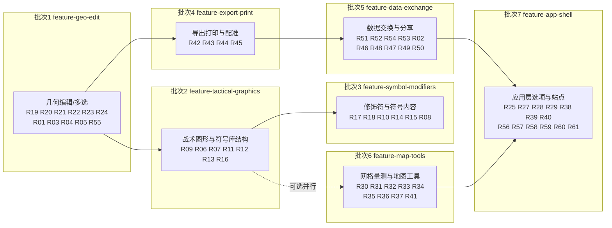

# 增量 PRD：与原站功能差距补齐路线图

> 文档类型：增量 PRD（Incremental PRD）
> 依据：`README.md` 第 106–238 行「路线图：与原站的功能差距」
> 基线：原站 **免费托管版（free hosted）**
> 编写人：许清楚（产品经理）
> 状态：待评审（含 12 项待确认问题）

---

## 1. 文档目的与范围

本文档把 README 中标注为 `[ ]`（未复刻）与 `[~]`（部分复刻）的条目，转化为**可执行、可分批、可验收**的需求池，
并给出 7 个可独立交付批次，供架构师与开发在此基础上做技术设计与实现。

### 1.1 范围边界

| 判定 | 内容 | 处理方式 |
| ---- | ---- | -------- |
| 纳入需求池 | README 中全部 `[ ]` 与 `[~]` 条目 | 编号 R01–R61，逐条给出目标与优先级 |
| **明确排除** | README「不在复刻范围」9 项（Pro 时间轴、BFT、GPS 追踪器、用户管理登录、自定义 WMTS/WMS、口令保护分享、封闭网络部署、MSS 符号服务、用户论坛） | **不进需求池**，任何批次不得实现 |
| 技术不可行 | 3D 视图（R26） | 见 §3 专项评估，建议**关闭**，价值由 R28 承担 |
| 服务端依赖降级 | R46（编辑覆盖）、R50（在线图层分享）、R61（作品提交）、R49（兵棋推演） | 保留条目，但以**纯前端替代方案**实现，详见对应行「期望目标」 |

### 1.2 需求池统计

| 来源标记 | 条数 | 说明 |
| -------- | ---- | ---- |
| `[ ]` 未复刻 | 46 | 全部纳入 |
| `[~]` 部分复刻 | 15 | 全部纳入 |
| **合计** | **61** | R01–R61 |
| 其中 P0 | 13 | 必须做（核心可用性与交付闭环） |
| 其中 P1 | 25 | 应该做（专业完整度） |
| 其中 P2 | 23 | 锦上添花（含 R26 建议不做） |

---

## 2. 需求池（完整，R01–R61）

> 优先级：**P0** = 必须有（不做则产品不成立）· **P1** = 应该有 · **P2** = 可以有
> 难度：**低**（≤2 人日）/ **中**（3–5 人日）/ **高**（≥6 人日或需算法攻坚）
> 依赖服务端：**是** 表示原站能力依赖服务端，本项目须以纯前端方案替代

### 一、图层与项目

| 编号 | 类别 | 需求名称 | 原站行为描述 | 当前现状 | 期望目标 | 优先级 | 难度 | 依赖服务端 |
| ---- | ---- | -------- | ------------ | -------- | -------- | ------ | ---- | ---------- |
| R01 | 一、图层与项目 | 会话持久化增强 | 原站无服务端存储，需手动导出 `.milxlyz` | 已有 localStorage 自动保存（**优于原站**） | 保持优势；补充「自动保存冲突/超限提示」与「恢复上次会话」入口，避免静默丢失 | P2 | 低 | 否 |
| R02 | 一、图层与项目 | 单图层粒度导入导出 | 可对单个图层导出为 MilX / 矢量图形 / 图像叠加 | 仅支持整档 `.milxly`/`.milxlyz`/GeoJSON 导入导出 | 图层右键菜单增加「导出此图层 / 导入到此图层」，格式能力复用第八批（R52/R54/R51） | P1 | 中 | 否 |
| R03 | 一、图层与项目 | 图层状态 working / approved | 图层可标记工作状态，用于审校流程 | 无状态字段 | 图层模型增加 `status` 字段，UI 提供状态徽标与切换 | P2 | 低 | 否 |
| R04 | 一、图层与项目 | 符号跨图层移动 | 多选后整批拖拽/移动到另一图层 | 无 | 依赖 R24 多选；提供「移动到图层…」命令 + 图层面板拖放 | P1 | 中 | 否 |
| R05 | 一、图层与项目 | 图层透明度 | 每个图层可独立设置不透明度 | 仅可见性开关 | 图层模型增加 `opacity`，Canvas/CSS 层统一应用 | P1 | 低 | 否 |

### 二、符号库

| 编号 | 类别 | 需求名称 | 原站行为描述 | 当前现状 | 期望目标 | 优先级 | 难度 | 依赖服务端 |
| ---- | ---- | -------- | ------------ | -------- | -------- | ------ | ---- | ---------- |
| R06 | 二、符号库 | 符号库六大分区重组 | My Favorites / Formations / Equipment and Installations / **Tactical Graphics** / Function-Specific / **Metoc** | 仅地面单位、空中、海面、水下四组，共 44 个符号 | 重建分组树为六大区，符号元数据增加 `category` 字段 | P1 | 中 | 否 |
| R07 | 二、符号库 | 符号搜索过滤与别名检索 | 按军标名或装备名（如 "F/A 18"）检索，结果实时过滤 | 支持中英文检索，但无结果过滤与别名 | 搜索命中后过滤面板列表；补充装备名别名词表 | P1 | 低 | 否 |
| R08 | 二、符号库 | 符号标准版本差异说明 | 基线为 **MIL-STD-2525C** | 按 **2525D / APP-6(D)** 实现（版本更新，但符号总数远少于原站 MSS） | 不做回退；在符号面板与文档中标注版本差异与覆盖范围（纯文档型需求） | P2 | 低 | 否 |
| R09 | 二、符号库 | 战术图形（多点符号） | 进攻/防御箭头、集结地域、分界线、走廊、相位线等 | 完全没有 | `core/symbology` 新增多点几何生成器（箭头/楔形/走廊/相位线），支持绘制期与编辑期复用 | **P0** | 高 | 否 |
| R10 | 二、符号库 | 气象海洋符号（Metoc） | 独立 Metoc 分区，含风、浪、气压等 | 无 | 新增 Metoc 符号集（APP-6(D) 附录），并入 R06 分区 | P2 | 高 | 否 |
| R11 | 二、符号库 | 职能符号（Function-Specific） | 紧急、维和等职能符号 | 无 | 新增 Function-Specific 符号集 | P2 | 中 | 否 |
| R12 | 二、符号库 | 装备与设施独立分组 | Equipment and Installations 独立成区 | 混在四组内 | 独立分组并补充常见装备/设施 SIDC | P1 | 中 | 否 |
| R13 | 二、符号库 | 收藏夹 | 右键加入 My Favorites | 无 | 符号右键「加入收藏」，收藏列表持久化到 localStorage | P1 | 低 | 否 |
| R14 | 二、符号库 | 工作模式 Standard / Extended | Extended 模式显示瑞士国家符号与额外修饰符 | 无模式概念 | 选项层增加模式开关；**瑞士国家符号是否纳入待确认（见 §6 Q2）** | P2 | 中 | 否 |
| R15 | 二、符号库 | 图标扩展修饰符 | Extended 模式下最多挂两个指示图标 | 无 | 修饰符模型支持 `modifierIcon1/2`，渲染时叠加指示图标 | P2 | 中 | 否 |
| R16 | 二、符号库 | 符号格式默认值 | 可设置线宽、填充色、字号与字体 | 硬编码 | 新增符号样式默认值配置，新建要素时套用，可被要素级属性覆盖 | P1 | 中 | 否 |

### 三、符号编辑与几何编辑

| 编号 | 类别 | 需求名称 | 原站行为描述 | 当前现状 | 期望目标 | 优先级 | 难度 | 依赖服务端 |
| ---- | ---- | -------- | ------------ | -------- | -------- | ------ | ---- | ---------- |
| R17 | 三、符号编辑 | 文本修饰符环绕排布 | 按军标定义的位置环绕基础符号排布 | 支持 4 类文本与机动方向，定位规则简化 | 按 2525D 文本修饰符锚点表实现上/下/左/右环绕与自动避让 | P1 | 中 | 否 |
| R18 | 三、符号编辑 | 完整非文本修饰符属性 | 兵力、部队代号、平台代号等完整属性 | 支持梯队、状态、司令部/特遣队、机动方向 | 补齐兵力数值、部队代号、平台代号等字段并接入检查器 | P1 | 中 | 否 |
| R19 | 三、几何编辑 | 点编辑器：增删移动参考点 | 选中要素后进入点编辑，可添加/移动/删除顶点 | 只能整体重绘 | `core/model` 提供顶点增删移纯函数（含单测）+ 画布顶点手柄交互 | **P0** | 高 | 否 |
| R20 | 三、几何编辑 | N 点编辑器键位模式 | Ctrl 插入点、Shift 删除点、Ctrl+←/→ 切换当前点 | 无 | 与 R19 同批实现键位映射，状态落在 `useViewStore` | **P0** | 中 | 否 |
| R21 | 三、几何编辑 | 顶点吸附（snapping） | 顶点吸附到已有要素顶点/网格 | 无 | 吸附源：自身顶点、其他要素顶点、网格交点；阈值可配置（默认 10px） | **P0** | 中 | 否 |
| R22 | 三、几何编辑 | 顶点方向重置 | 可重置顶点方向（影响箭头/走廊朝向） | 无 | 提供「重置方向」命令，复位到几何默认切线方向 | P1 | 低 | 否 |
| R23 | 三、几何编辑 | 复制 / 粘贴 | Ctrl+C / Ctrl+V 复制选中要素 | 无 | 剪贴板抽象（内存 + localStorage 兜底），粘贴时偏移避免重叠 | **P0** | 中 | 否 |
| R24 | 三、几何编辑 | 多选 | Ctrl+点击 与 Ctrl+框选 | 仅单选 | 选择集合进入 `useDocumentStore`，支持框选与 Ctrl 增减选 | **P0** | 中 | 否 |

### 四、底图与视图

| 编号 | 类别 | 需求名称 | 原站行为描述 | 当前现状 | 期望目标 | 优先级 | 难度 | 依赖服务端 |
| ---- | ---- | -------- | ------------ | -------- | -------- | ------ | ---- | ---------- |
| R25 | 四、底图与视图 | 底图样式扩充 | OSM / OpenTopoMap / Google / swisstopo 等多家 | 3 种无密钥公开底图 | 扩充到 6–8 种**无密钥公开**底图；Google / swisstopo 因需密钥或商业授权**不建议纳入**（见 §6 Q5） | P1 | 低 | 否 |
| R26 | 四、底图与视图 | 3D 视图 | 高度升降、航向/俯仰控制、图层可见性与透明度面板 | 已通过 Cesium 只读视图实现 | 保持 2D/3D 切换、相机控制与图层透明度同步；后续再补地形数据 | P1 | 高 | 否 |
| R27 | 四、底图与视图 | 太平洋视图（投影中心切换） | 可切换投影中心经线，便于跨太平洋标图 | 固定 Web Mercator 中心 | 提供 `ProjectionCenter` 选项（0° / 180°），平移与 MGRS 计算同步适配 | P2 | 中 | 否 |
| R28 | 四、底图与视图 | 地形晕渲 | 底图叠加地形晕渲（hillshade） | 无 | 接入公开无密钥 hillshade 瓦片源，作为可切换叠加层 | P2 | 中 | 否 |
| R29 | 四、底图与视图 | 底图标注语言设置 | 可指定底图标注语言 | 无 | 透传给支持 `lang` 参数的瓦片源；不支持的底图此项置灰 | P2 | 低 | 否 |

### 五、坐标网格与地图工具

| 编号 | 类别 | 需求名称 | 原站行为描述 | 当前现状 | 期望目标 | 优先级 | 难度 | 依赖服务端 |
| ---- | ---- | -------- | ------------ | -------- | -------- | ------ | ---- | ---------- |
| R30 | 五、网格 | 坐标网格体系扩充 | MGRS / UTM / WGS84 / GARS / BNG / LV95·LV03 / 六边形 | 支持 MGRS / UTM / BNG | 优先补 **GARS** 与 **WGS84 经纬网**；LV95/LV03 与六边形网格待确认（§6 Q7） | P1 | 高 | 否 |
| R31 | 五、地图工具 | 距离、面积与方位角量测 | 完整量测工具，含多段累加与结果标注 | 部分复刻 | 补齐多段折线累加面积、量测结果保留与删除、量测图层 | P1 | 中 | 否 |
| R32 | 五、地图工具 | 坐标搜索跳转 | 输入 WGS84 / MGRS / UTM / GARS / BNG 坐标跳转定位 | 无 | 工具栏坐标搜索框，解析失败给出明确错误提示 | P1 | 中 | 否 |
| R33 | 五、地图工具 | 距离环 / 武器威胁半径 | 以某点为中心绘制半径环 | 无 | 半径环要素类型，半径单位遵循 R39 约定，支持多环 | P1 | 中 | 否 |
| R34 | 五、地图工具 | 指北针 | 画布指北针控件 | 无 | Leaflet 控件；随 R35 支持真北/磁北 | P1 | 低 | 否 |
| R35 | 五、地图工具 | 磁偏角 WMM2025 | WMM2025 计算、真北/磁北切换、GM 角显示 | 无 | `core/geo` 实现 WMM2025（实现方式待确认，§6 Q3），状态栏与指北针显示 | P1 | 高 | 否 |
| R36 | 五、地图工具 | 放大镜 | 按住 D 键局部放大 | 无 | 按住 D 显示跟随鼠标的放大浮层 | P2 | 中 | 否 |
| R37 | 五、地图工具 | 自身地理定位 | 浏览器定位并居中 | 无 | 使用 `navigator.geolocation`，失败时提示权限原因 | P2 | 低 | 否 |

### 六、选项

| 编号 | 类别 | 需求名称 | 原站行为描述 | 当前现状 | 期望目标 | 优先级 | 难度 | 依赖服务端 |
| ---- | ---- | -------- | ------------ | -------- | -------- | ------ | ---- | ---------- |
| R38 | 六、选项 | 语言切换 | 原站 en/de/fr/it | 应用界面仅中文（站点已五语言） | 应用内 i18n（**是否值得做待确认，§6 Q6**），最小方案为 en + zh | P1 | 中 | 否 |
| R39 | 六、选项 | 工作模式与单位约定 | 可切换米 / 码 | 固定公制 | 单位约定选项，作用于量测、半径环、比例尺 | P2 | 低 | 否 |
| R40 | 六、选项 | 地图工具开关 | 可开关坐标搜索、指北针、量测等 | 无统一开关 | 选项面板集中开关地图工具可见性 | P1 | 低 | 否 |
| R41 | 六、选项 | 坐标系设置 | 可切换显示坐标系 | 可在 MGRS / UTM / BNG 间切换 | 补入 WGS84 / GARS（依赖 R30），设置持久化 | P1 | 低 | 否 |

### 七、导出与打印

| 编号 | 类别 | 需求名称 | 原站行为描述 | 当前现状 | 期望目标 | 优先级 | 难度 | 依赖服务端 |
| ---- | ---- | -------- | ------------ | -------- | -------- | ------ | ---- | ---------- |
| R42 | 七、导出打印 | PNG 导出选项增强 | 高质量位图导出 | 已实现 PNG 导出，无地理配准与归属标签 | 增加导出范围（当前视口 / 全图）、倍率、透明底选项；配准与归属分别见 R44 / R45 | P1 | 中 | 否 |
| R43 | 七、导出打印 | 打印与 PDF 导出 | 纸张 A4/A3、方向、DPI、1:25 000 比例尺校验 | 无 | 打印布局引擎（core/io 纯逻辑）+ 打印预览；**技术路线待确认（§6 Q8）** | **P0** | 高 | 否 |
| R44 | 七、导出打印 | 地理配准图片 | JPG + `.jgw` / PNG + `.pgw`（world file，WGS84 度每像素） | 无 | `core/io` 计算 world file 六参数并成对下载 | **P0** | 中 | 否 |
| R45 | 七、导出打印 | 归属 / 版权标签 | 导出图右下角自动附加归属（原站为法律要求项） | 无 | 导出/打印统一叠加归属文本（底图来源 + 应用名 + 时间戳） | **P0** | 低 | 否 |

### 八、数据交换

| 编号 | 类别 | 需求名称 | 原站行为描述 | 当前现状 | 期望目标 | 优先级 | 难度 | 依赖服务端 |
| ---- | ---- | -------- | ------------ | -------- | -------- | ------ | ---- | ---------- |
| R46 | 八、数据交换 | 分享链接三种形态 | 只读 / 编辑副本 / 编辑覆盖 | 无 | **纯前端降级**：只读链接与编辑副本链接以 URL 载荷实现；「编辑覆盖」需服务端，**明确不做** | **P0** | 中 | 部分（编辑覆盖=是） |
| R47 | 八、数据交换 | iframe 嵌入代码生成 | 生成可嵌入的 iframe 代码 | 无 | 生成 `<iframe src="...">` 片段并一键复制（依赖 R48 的 URL 加载） | P2 | 低 | 否 |
| R48 | 八、数据交换 | URL 参数加载 MilX 图层 | 通过 URL 直接加载图层 | 无 | 定义 URL 载荷格式（内联压缩 / 外链 URL 二选一），启动时解析 | **P0** | 中 | 否 |
| R49 | 八、数据交换 | 兵棋推演模式 | 双方对抗、裁判控制、隐藏信息 | 无 | **纯前端降级**为「演示模式」：红蓝方图层分组 + 视角预设 + 裁判视图切换；**不宣称信息安全**（§6 Q4） | P2 | 高 | 部分（真隐藏=是） |
| R50 | 八、数据交换 | 在线图层分享 | KML / GeoJSON 在线分享，接收方免上传 | 无 | **纯前端降级**：由 R46 分享链接承担；不实现任何托管服务 | P2 | 中 | **是** |
| R51 | 八、数据交换 | NVG 导入 | NATO Vector Graphics 2.0.0 / 2.0.2 | 无 | `core/io` 新增 NVG 解析器，映射为要素 + 2525 SIDC | P1 | 高 | 否 |
| R52 | 八、数据交换 | KML 导入导出 | 完整 KML 往返 | 无 | `core/io` 新增 KML 解析与序列化（Point/LineString/Polygon + 扩展属性） | **P0** | 中 | 否 |
| R53 | 八、数据交换 | 图像叠加层导入 | 导入图像作为叠加层（原站用作自定义符号变通方案） | 无 | 新增图像叠加图层类型（本地文件 + 图幅四至配准）；**CORS 限制待确认（§6 Q9）** | P2 | 中 | 否 |
| R54 | 八、数据交换 | MilX 原生 XML 互转 | `.milx` 原生格式导入导出 | 无 | `core/io` 新增 `.milx` 解析与序列化，与内部模型双向映射 | **P0** | 高 | 否 |

### 九、应用与平台

| 编号 | 类别 | 需求名称 | 原站行为描述 | 当前现状 | 期望目标 | 优先级 | 难度 | 依赖服务端 |
| ---- | ---- | -------- | ------------ | -------- | -------- | ------ | ---- | ---------- |
| R55 | 九、应用平台 | 键盘快捷键补齐 | 全屏 F11、强制重载 Ctrl+F5、复制粘贴、方向键平移、Z/X 缩放、N 重置朝北、Space 确认、S 吸附 | 仅撤销重做、删除、Esc、画布内结束绘制 | 建立统一快捷键注册表，覆盖上表全部键位并可被输入框场景豁免 | P1 | 中 | 否 |
| R56 | 九、应用平台 | PWA 安装与文件关联 | 安装为应用并关联 `.milxlyz` | manifest 已声明 `file_handlers`，未实现运行时接收 | 用 `launchQueue` 接收打开文件；不支持时降级为手动导入 | P2 | 中 | 否 |
| R57 | 九、应用平台 | 全屏模式 | 全屏标图 | 无 | Fullscreen API + 快捷键 F11 接管 | P2 | 低 | 否 |
| R58 | 九、应用平台 | 新版本更新提示 | PWA 更新后提示重载 | 无 | 监听 SW `updatefound`，显示「有新版本，点击重载」 | P2 | 低 | 否 |
| R59 | 九、应用平台 | 大图层性能优化 | 大量要素下仍流畅 | 未优化 | Canvas 渲染分层 + 视口裁剪 + 拖拽期降精度；**性能目标阈值待确认（§6 Q10）** | P1 | 高 | 否 |

### 十、站点与内容

| 编号 | 类别 | 需求名称 | 原站行为描述 | 当前现状 | 期望目标 | 优先级 | 难度 | 依赖服务端 |
| ---- | ---- | -------- | ------------ | -------- | -------- | ------ | ---- | ---------- |
| R60 | 十、站点内容 | 示例画廊升级 | 真实用户态势图（iframe 嵌入 + 视频 + 每月精选） | 示例页为符号陈列 | 增加 2–3 个态势图示例（依赖 R47 嵌入能力）与说明文案 | P2 | 中 | 否 |
| R61 | 十、站点内容 | 用户作品提交与展示 | 用户提交作品并展示 | 无 | **纯前端降级**：静态页提供提交指引（GitHub Issue / 邮件外链）；不做在线提交与托管 | P2 | 低 | **是** |

---

## 3. 专项评估：3D 视图（R26，已交付首版）

| 评估维度 | 结论 |
| -------- | ---- |
| 技术前提 | 真 3D（高度升降、航向/俯仰）需要 WebGL 三维场景与地形/建筑数据 |
| 当前栈能力 | 2D 继续使用 Leaflet；3D 通过按需加载 Cesium，避免影响首屏绘制 |
| 已交付能力 | 只读地球、图层可见性/透明度、航向、俯仰、升降与朝北控制 |
| 约束 | 3D 暂不提供顶点编辑；切回 2D 后恢复完整编辑工具 |
| 后续 | 可在独立批次接入公开地形服务与 3D 网格，保持 Cesium 动态分包 |

> 结论：R26 已完成首版交付，后续增强按性能与数据许可单独排期。

---

## 4. 分批交付计划

### 4.1 批次总览（Mermaid）

### 4.2 排序与依赖理由

| 顺序 | 理由 |
| ---- | ---- |
| 批次 1 最先 | 几何编辑与多选是**其余一切编辑类需求的地基**：R04 跨图层移动依赖 R24 多选，R22/R20 依赖 R19 点编辑器；且本批以 `core/model` 纯函数 + 单测先行，符合「core 先于 UI」 |
| 批次 2 次之 | 战术图形（R09）是军标标图的**核心差异化能力**，且依赖批次 1 建立的多点采点与编辑框架 |
| 批次 3 | 符号内容扩充依赖批次 2 建立的分组与符号元数据模型 |
| 批次 4 | 导出/打印依赖文档模型稳定（批次 1 已定型），且布局与配准计算位于 `core/io`，可独立测试 |
| 批次 5 | 分享链接（R46/R48）依赖 R54/R52 的序列化能力，KML/MilX/NVG 解析器集中在 `core/io`，内聚性最强 |
| 批次 6 | 与批次 5 可并行；以 `core/geo` 算法为主（GARS、WMM2025），UI 依赖少 |
| 批次 7 | 多为独立小项与应用层打磨，放在最后风险最低 |

### 4.3 批次明细

#### 批次 1 · `feature-geo-edit` · 几何编辑与选择模型

| 项 | 内容 |
| -- | ---- |
| 包含编号 | R19 R20 R21 R22 R23 R24 R01 R03 R04 R05 R55 |
| 前置 | 无 |
| core 先行 | `core/model`：顶点插入/删除/移动、点命中检测、包围盒、吸附候选集、剪贴板序列化（纯函数 + 单测） |
| UI 后行 | `features/draw` 顶点手柄与编辑态；`features/inspector` 多选态；`features/layers` 状态徽标、透明度、移动到图层；快捷键注册表 |
| 演示价值 | 选中一个箭头，拖动顶点改形、Ctrl 加点、复制粘贴出第二个、批量拖到另一图层 |
| 验收 | `npm run ci` 全绿；新增单测 ≥ 25 条；手动冒烟 6 步 |

#### 批次 2 · `feature-tactical-graphics` · 战术图形与符号库结构

| 项 | 内容 |
| -- | ---- |
| 包含编号 | R09 R06 R07 R11 R12 R13 R16 |
| 前置 | 批次 1 |
| core 先行 | `core/symbology`：多点符号几何生成器（进攻/防御箭头、集结地域、分界线、走廊、相位线）、符号分类元数据、别名词表 |
| UI 后行 | `features/symbol` 六大分区面板、结果过滤、收藏、样式默认值；`features/draw` 多点绘制交互 |
| 演示价值 | 从 Tactical Graphics 区拖出一个进攻箭头，连续采点成形，随后可编辑顶点 |
| 验收 | `npm run ci` 全绿；新增单测 ≥ 30 条；符号总数由 44 提升至 ≥ 90 |

#### 批次 3 · `feature-symbol-modifiers` · 修饰符与符号内容扩充

| 项 | 内容 |
| -- | ---- |
| 包含编号 | R17 R18 R10 R14 R15 R08 |
| 前置 | 批次 2 |
| core 先行 | `core/symbology`：文本修饰符锚点表与环绕布局、扩展修饰符（双指示图标）、Metoc 符号集、工作模式策略 |
| UI 后行 | `features/inspector` 完整修饰符表单；`features/symbol` Metoc/职能分区与模式切换入口 |
| 演示价值 | 给一个单位符号加上兵力、部队代号与两个指示图标，文本自动环绕排布 |
| 验收 | `npm run ci` 全绿；新增单测 ≥ 20 条 |

#### 批次 4 · `feature-export-print` · 导出、打印与地理配准

| 项 | 内容 |
| -- | ---- |
| 包含编号 | R42 R43 R44 R45 |
| 前置 | 批次 1 |
| core 先行 | `core/io`：纸张布局计算（A4/A3 × 横竖 × DPI）、比例尺校验（1:25 000）、world file 六参数、归属标签布局 |
| UI 后行 | `features/io` 导出对话框与打印预览页 |
| 演示价值 | 导出 A3 横向 300 DPI 成图，附带 `.pgw`，右下角自动署名；浏览器打印预览比例尺校验通过 |
| 验收 | `npm run ci` 全绿；新增单测 ≥ 20 条；导出产物可被 QGIS 正确配准（人工抽检） |
| 备注 | 条目仅 4 个，但打印布局引擎与配准计算为**高难度**，工作量与其他批次相当 |

#### 批次 5 · `feature-data-exchange` · 数据交换与分享

| 项 | 内容 |
| -- | ---- |
| 包含编号 | R51 R52 R54 R53 R02 R46 R48 R47 R49 R50 |
| 前置 | 批次 1（文档模型定型） |
| core 先行 | `core/io`：KML 解析/序列化、MilX XML 解析/序列化、NVG 解析、图像叠加配准、URL 载荷压缩编码 |
| UI 后行 | `features/io` 导入导出菜单与分享对话框；图层右键单图层导入导出（R02） |
| 演示价值 | 导入一份 KML，编辑后导出 `.milx`，生成只读分享链接，对方打开即看到同样态势图 |
| 验收 | `npm run ci` 全绿；KML/MilX/NVG 各 ≥ 10 条往返单测 |
| 红线 | **不得实现任何服务端托管与口令保护**；R50 仅以分享链接形式降级实现 |

#### 批次 6 · `feature-map-tools` · 坐标网格、量测与地图工具

| 项 | 内容 |
| -- | ---- |
| 包含编号 | R30 R31 R32 R33 R34 R35 R36 R37 R41 |
| 前置 | 无强依赖（可与批次 5 并行） |
| core 先行 | `core/geo`：GARS 编解码、WGS84 经纬网生成、WMM2025 磁偏角、坐标串解析器；`core/model` 半径环几何 |
| UI 后行 | `features/map` 网格层与指北针/放大镜控件；`features/statusbar` 磁偏角与 GM 角；`features/toolbar` 坐标搜索 |
| 演示价值 | 切换 GARS 网格，输入 MGRS 坐标跳转，围绕一个目标画三个威胁半径环，指北针切到磁北 |
| 验收 | `npm run ci` 全绿；GARS/WMM 与公开参考值交叉验证，新增单测 ≥ 30 条 |

#### 批次 7 · `feature-app-shell` · 应用层、选项与站点内容

| 项 | 内容 |
| -- | ---- |
| 包含编号 | R25 R27 R28 R29 R38 R39 R40 R56 R57 R58 R59 R60 R61 |
| 前置 | 批次 5（R60 依赖 R47 嵌入能力） |
| core 先行 | `core/io` 持久化与 i18n 词表；渲染层视口裁剪策略 |
| UI 后行 | 选项面板（底图、语言、单位、工具开关、投影中心）；`features/toolbar` 全屏；SW 更新提示；PWA 文件关联；站点示例页升级 |
| 演示价值 | 切换 OpenTopoMap + 地形晕渲 + 英文界面 + 码制单位，全屏演示，安装为 PWA 后双击 `.milxlyz` 直接打开 |
| 验收 | `npm run ci` 全绿；1000 要素视口下拖拽帧率 ≥ 30fps（人工观测） |
| 备注 | 条目多（13 个）但多为**低难度**独立小项，总量与前列批次均衡 |

### 4.4 节奏与质量门

| 门 | 要求 |
| -- | ---- |
| 分支命名 | 全部使用连字符：`feature-geo-edit` / `feature-tactical-graphics` / `feature-symbol-modifiers` / `feature-export-print` / `feature-data-exchange` / `feature-map-tools` / `feature-app-shell`（**禁止斜杠**） |
| 合流路径 | `feature-*` → PR → `develop` → `main` |
| 提交规范 | Conventional Commits，PR 标题由 CI 校验 |
| 每批出门条件 | `npm run ci`（lint + format:check + test + build）全绿 + 可演示场景 + README 路线图图例同步更新 |
| 测试策略 | core 层必须有单测；UI 层以手动冒烟清单为准 |

---

## 5. 用户故事（P0 需求，共 13 条）

| 编号 | 用户故事 | 验收要点 |
| ---- | -------- | -------- |
| R09 | 作为**参谋人员**，我希望从符号库拖出进攻箭头、集结地域、分界线等多点战术图形，以便表达作战企图与任务编成 | 5 类多点符号可绘制、可编辑、可导出 |
| R19 | 作为**标图员**，我希望选中要素后拖动顶点改形、增删参考点，以便不必重画就能修正标图 | 顶点手柄可拖、可加、可删，几何结果正确 |
| R20 | 作为**键盘流标图员**，我希望用 Ctrl 插入点、Shift 删除点、Ctrl+←/→ 切换当前点，以便高效编辑 N 点图形 | 三个键位在多点编辑态生效且不冲突 |
| R21 | 作为**标图员**，我希望顶点能自动吸附到已有要素与网格交点，以便图形严丝合缝 | 吸附阈值内自动对齐，可临时关闭（S） |
| R23 | 作为**标图员**，我希望 Ctrl+C / Ctrl+V 复制要素，以便快速生成同型单位 | 粘贴后偏移可见、属性完整复制 |
| R24 | 作为**标图员**，我希望 Ctrl+点击与 Ctrl+框选进行多选，以便批量操作 | 选择集合正确，批量移动/删除/改属性生效 |
| R43 | 作为**参谋人员**，我希望按 A4/A3、方向与 DPI 打印或导出 PDF，并校验 1:25 000 比例尺，以便生成符合参谋作业规范的纸质图 | 打印预览比例尺误差 ≤ 1% |
| R44 | 作为**GIS 分析人员**，我希望导出 JPG+`.jgw` 或 PNG+`.pgw` 地理配准图片，以便在 QGIS / 其他系统中叠加使用 | world file 六参数正确，第三方软件可配准 |
| R45 | 作为**合规负责人**，我希望导出图自动附带底图归属与版权标签，以履行底图许可的法律要求 | 所有导出/打印产物右下角均有归属标签 |
| R46 | 作为**协同作业人员**，我希望生成只读或「编辑副本」分享链接，以便把态势图发给未安装本应用的同事 | 链接打开即还原态势图；副本链接不回写原内容 |
| R48 | 作为**接收方**，我希望通过 URL 参数直接加载 MilX 图层，以便免安装查看他人分享的标图 | 启动时解析 URL 载荷并渲染 |
| R52 | 作为**跨系统协作人员**，我希望导入导出 KML，以便与 Google Earth 及主流 GIS 交换数据 | 点/线/面往返无损，属性保留 |
| R54 | 作为**军标专业用户**，我希望读写 MilX 原生 `.milx` XML，以便与原站及其他军标系统互通 | 往返一致，SIDC 与修饰符不丢失 |

---

## 6. 待确认问题（需主理人拍板）

| # | 问题 | 影响范围 | 建议 |
| - | ---- | -------- | ---- |
| Q1 | 分享链接的「编辑覆盖」形态需服务端，是否确认只做**只读**与**编辑副本**两种？ | R46 | 建议只做两种，README 中标注差异 |
| Q2 | Extended 模式是否纳入**瑞士国家符号**（CH 符号集）？涉及额外符号数据与测试量 | R14 R15 | 建议**本期不做**，仅保留模式开关骨架 |
| Q3 | WMM2025 磁偏角如何实现？自实现 12 阶球谐（需嵌入 NOAA 系数表，约 170 个系数）或引入第三方库？ | R35 | 建议自实现 `core/geo`，避免新增依赖与许可风险；需确认可接受系数表体积 |
| Q4 | 兵棋推演的「隐藏信息」在纯前端无法保证安全，是否接受**演示级**实现（红蓝方图层 + 视角切换）？ | R49 | 建议接受演示级，并在 UI 明示「非安全隔离」 |
| Q5 | 底图是否只纳入**无密钥公开源**？Google / swisstopo 需密钥或商业授权 | R25 R29 | 建议只做无密钥源，Google / swisstopo 明确不做 |
| Q6 | 应用界面是否要做 en/de/fr/it i18n 改造？工作量集中在 UI 文案抽离 | R38 | 建议首期只做 **zh + en**，de/fr/it 留待后续 |
| Q7 | 网格体系是否纳入 **LV95/LV03（瑞士）** 与**六边形网格**？两者规格在原站文档未明示 | R30 | 建议本期只做 **GARS + WGS84 经纬网**，其余待规格明确后再议 |
| Q8 | PDF 导出走浏览器打印（`window.print` + `@page` CSS）还是引入 PDF 库？ | R43 | 建议**浏览器打印优先**，零依赖；若版式不可控再评估 PDF 库 |
| Q9 | 图像叠加层导入涉及本地文件读取与跨域限制，是否接受「仅本地文件 + 手动配准」？ | R53 | 建议接受，外链图片因 CORS 明确不支持 |
| Q10 | 大图层性能优化的目标阈值是多少（要素数量级）？ | R59 | 建议以 **2000 要素 / 拖拽 ≥ 30fps** 为验收基线 |
| Q11 | MilX 原生 `.milx` 是否有官方 schema 或样例文件？若无，按现有模型反推的结构是否可接受？ | R54 | 需主理人提供样例或授权以 GeoJSON 结构等价反推 |
| Q12 | 3D 视图是否确认**关闭**？若坚持要，需另立「替换地图内核」技术预研议题 | R26 | 建议关闭，定位为 2D 标图工具 |

---

## 7. 交付与验收总览

| 项 | 说明 |
| -- | ---- |
| 需求总数 | 61（R01–R61），其中 R26 建议关闭，实际排期 60 |
| 批次数量 | 7 个，每个一条功能分支（连字符命名） |
| 每批出门 | `npm run ci`（lint + format:check + test + build）全绿 |
| 全局红线 | 不实现 README「不在复刻范围」的 9 项；不引入任何服务端依赖；分支名不含斜杠 |
| 文档同步 | 每批合入后同步更新 README 路线图的 `[ ]` / `[~]` / `[x]` 图例 |
